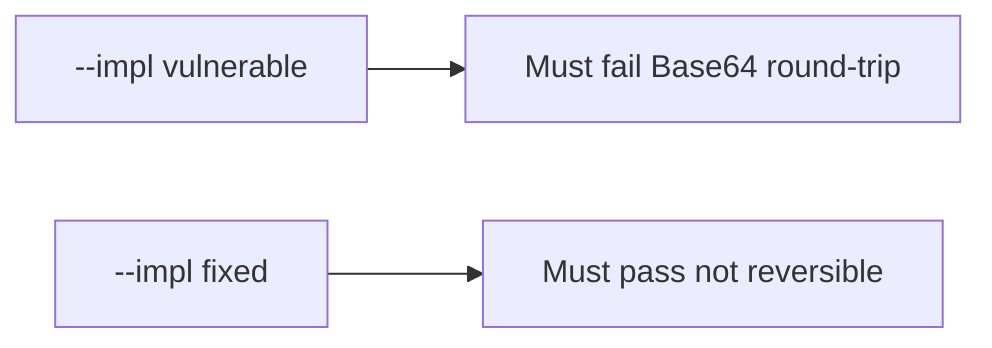

# 5.2-LO-05 — Evidence is not-Base64, then a passing pair

**Kind:** verification-lab
**Loop step:** 5 Verify
**Standards:** OWASP ASVS 5.0.0 (final) `v5.0.0-11.3.3`.

## An invariant that cannot fail a test is still a slogan

“We use AES” is not evidence. The oracle is the local pair.

## Mental model: fail-on-vulnerable, pass-on-fixed



| Case | Must show |
|---|---|
| Negative / abuse | Base64 of `secret` is rejected |
| Normal | output is not plaintext; teaching flag present on fixed |
| Not claimed | Real AES-GCM; key storage; nonce uniqueness |

```
python3 -m pytest labs/5.2/5.2-lab/tests --impl vulnerable
python3 -m pytest labs/5.2/5.2-lab/tests --impl fixed
```

## What the tests do not prove

- Key lifecycle (5.3)
- TLS (5.4)
- PQC plan (`v5.0.0-11.1.4` Level 3 advanced)

## Practice

Execute both implementations. Map each test to an LO-02 cell.

## Transfer

Clinic SSN. A test that only asserts the column is non-null is not confidentiality evidence.
