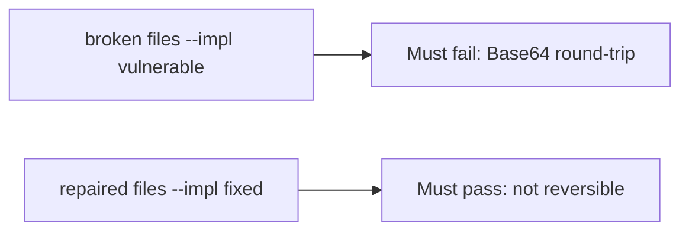

# Fail on the broken files, then pass on the repaired ones

**Kind:** verification-lab
**Loop step:** 5 Verify

## If you cannot test it, it is still a slogan

“We use AES” is not evidence. “Column is bytea” is a tool observation. The check is: Base64 decode of `protect("secret")` is not `"secret"`, and `looks_encrypted` is true on the repaired stand-in. That observation must be **false** on the broken files (decode equals secret) and **true** on the repaired files.

## Picture: Base64 round-trip must fail the check

A passing collection count is not this cell. The failing observation on the broken files is **Base64 round-trip**.



If both pass, the test is not looking at Base64 decode of `protect("secret")`. If both fail, the fix is not structural or the check is wrong.

## Four modes, even for one field

| Mode | Must show for this topic |
|---|---|
| Normal | Output is not plaintext; teaching flag present on repaired files |
| Wrong input / abuse | Base64 of `secret` is rejected; broken files must fail |
| Failure | If the library is missing, refuse the write — do not store plaintext |
| Not claimed | Real AES-GCM; key storage; nonce uniqueness |

The file is `labs/5.2/5.2-lab/tests/test_property.py`. The test `test_protect_is_not_mere_encoding` is a **what-must-not-happen** test: reversible encoding is not allowed to count as a passing control.

A test that only greps `AES` in a comment without decoding `protect("secret")` is not this topic's evidence. This practice never opens a live column.

```text
python3 -m pytest labs/5.2/5.2-lab/tests --impl vulnerable
python3 -m pytest labs/5.2/5.2-lab/tests --impl fixed
```

`test_protect_does_not_return_plaintext` may pass on both if the broken files already Base64. That does not excuse the round-trip test. If the broken files do not fail Base64 decode, the lab is miswired — fix the wiring, not the assertion. An environment error is not security evidence.

## What the tests do not prove

- Key lifecycle (later)
- TLS (later)
- A post-quantum plan (advanced; not this pytest)
- Nonce uniqueness (advanced; not this pytest)
- A production AES-GCM implementation

Record those as leftover or later topics, not as silent passes.

## Practice

Run both this session:

```text
python3 -m pytest labs/5.2/5.2-lab/tests --impl vulnerable
python3 -m pytest labs/5.2/5.2-lab/tests --impl fixed
```

Paste nothing from answer keys. Write fail/pass into your notes next to the matrix row. Reject a “test” that only greps `AES` in a comment without decoding `protect("secret")`.

## Use it somewhere new

Clinic SSN. A test that only asserts the column is non-null is not secrecy evidence. A test that decodes a live clinic column is out of scope.

## What this page is not doing

Do not add a live decoder. Do not log plaintext `secret`. Keys stay out of this file.
