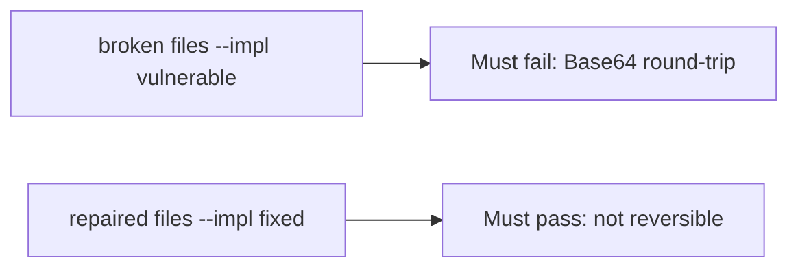

# A Base64 round-trip must fail the check

**Kind:** verification-lab
**Loop step:** 5 Verify

## Check it

Naming AES in a comment does not encrypt the body. A `bytea` column type is storage. Base64 decode of `protect("secret")` must not be `"secret"`, and `looks_encrypted` has to be true on the repaired stand-in. On the broken files decode still equals secret. On the repaired files it does not.

## Picture: Base64 round-trip must fail the check

A green tally of passing tests is not the Base64 check. The failing observation on the broken files is **Base64 round-trip**.



If both pass, you are not looking at Base64 decode of `protect("secret")`.

## What the check has to show

| Mode | Must show for this topic |
|---|---|
| Normal | Output is not plaintext; teaching flag present on repaired files |
| Wrong input / abuse | Base64 of `secret` is rejected; broken files must fail |
| Failure | If the library is missing, refuse the write — do not store plaintext |
| Not claimed | Real AES-GCM; key storage; nonce uniqueness |

The test `test_protect_is_not_mere_encoding` is there so reversible encoding still fails.

An `AES` comment is not a decode of `protect("secret")`. This practice never opens a live column.

```text
python3 -m pytest labs/5.2/5.2-lab/tests --impl vulnerable
python3 -m pytest labs/5.2/5.2-lab/tests --impl fixed
```

`test_protect_does_not_return_plaintext` may pass on both sides if the broken files already Base64. You still have to fail a round-trip decode. If the broken files do not fail Base64 decode, the lab is miswired — fix the wiring, not the assertion. A setup error is not proof the rule holds.

## What the tests do not prove

- Key lifecycle (later)
- TLS (later)
- A post-quantum plan (advanced; not this check)
- Nonce uniqueness (advanced; not this check)
- A production AES-GCM implementation

## Practice

Decode `protect("secret")`. An `AES` comment is a name, not ciphertext.

## Use it somewhere new

A non-null SSN column is not secrecy evidence. Do not run a test that decodes a live clinic column.

## What this page is not doing

Do not add a live decoder. Do not log plaintext `secret`. Keys stay out of this file.
