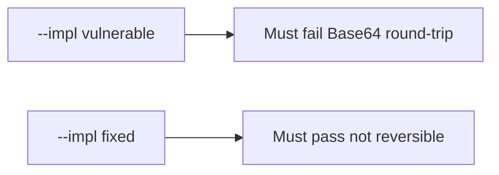

# 5.2-LO-05 — Evidence is not-Base64, then a passing pair

**Kind:** verification-lab
**Loop step:** 5 Verify
**Standards:** OWASP ASVS 5.0.0 (final) `v5.0.0-11.3.3`.

## An invariant that cannot fail a test is still a slogan

“We use AES” is not evidence. “Column is bytea” is a mechanism observation. The oracle is: Base64 decode of `protect("secret")` is not `"secret"`, and `looks_encrypted` is true on the fixed stand-in. That observation must be **false** on `--impl vulnerable` (decode equals secret) and **true** on `--impl fixed`.

## Mental model: vulnerable must fail: Base64 round-trip

The failing observation on `--impl vulnerable` is **Base64 round-trip**. A passing collection count is not this cell.



| Mode | Must show for this module |
|---|---|
| Normal | output is not plaintext; teaching flag present on fixed |
| Negative / abuse | Base64 of `secret` is rejected; vulnerable must fail |
| Not claimed | Real AES-GCM; key storage; nonce uniqueness |

Lab tests in `labs/5.2/5.2-lab/tests/test_property.py`. `test_protect_is_not_mere_encoding` is a **forbidden-outcome** test: reversible encoding is not allowed to count as a passing control.

```text
python3 -m pytest labs/5.2/5.2-lab/tests --impl vulnerable
python3 -m pytest labs/5.2/5.2-lab/tests --impl fixed
```

`test_protect_does_not_return_plaintext` may pass on both if the vulnerable tree already Base64s. That does not excuse the round-trip test. If vulnerable does not fail Base64 decode, the lab is miswired—fix the wiring, not the assertion.

## What the tests do not prove

- Key lifecycle (5.3)
- TLS (5.4)
- PQC plan (`v5.0.0-11.1.4` Level 3 advanced)
- Nonce uniqueness (`v5.0.0-11.3.4` Level 3 advanced)
- A production AES-GCM implementation (`v5.0.0-11.2.1`)

Record those as residuals or later modules, not as silent passes.

## Practice

Execute both implementations this session. Write the fail/pass pair next to the matrix row. Reject a “test” that only greps `AES` in a comment without decoding `protect("secret")`.

## Transfer

Clinic SSN. A test that only asserts the column is non-null is not confidentiality evidence (see 9.3). A test that decodes a live EHR column is out of scope.

## Non-goals

Do not add a live decoder. Do not log plaintext `secret`. Keys stay out of this file.
