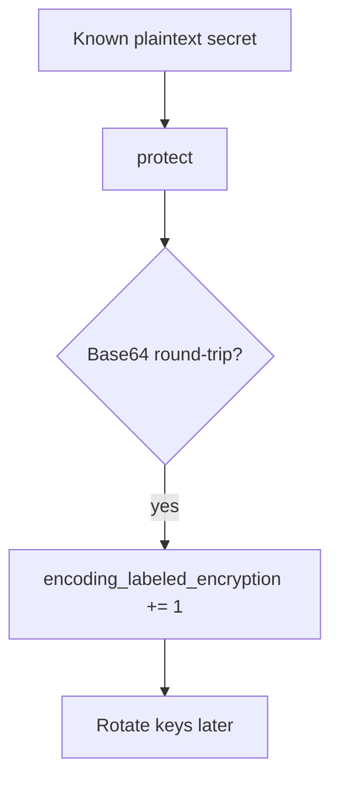

# Notice known-plaintext encoding; treat it as a leak

**Kind:** operations-exercise
**Loop step:** 6 Operate

## Fixing it once is not enough

A new encoding wrapper can land in a worker after `protect` prefixes `aesgcm:`. Notice that wrapper, contain the worker, re-protect the column, and do not log note bodies.

Keep plaintext bodies and SSNs out of the ticket.

## Picture: CI is a detector

If Base64 still decodes to plaintext, the body does not belong in the pager. Then re-protect and rotate keys.



A log product does not encrypt the column.

## Signals that do not become a second leak

| Outcome | This topic |
|---|---|
| Notice | known-plaintext Base64 in CI |
| What the line holds | field name, request id — **never** the body |
| Recover | Re-protect with authenticated encryption; rotate keys |
| Leftover | Memory dumps; operators who are allowed to hold the key |

```text
log_denied reason=encoding_labeled_encryption field=body request_id=req_52cr
```

Plaintext `secret`, a real SSN, or “AES handled” in the key sample is a second key store.

A plaintext `secret` or an SSN in the encryption-miss ticket is another key dump.

An “encryption enabled” checkbox does not stop Base64. Touch `protect` and `test_protect_is_not_mere_encoding` has to stay red on Base64. Workers and export jobs still Base64 if you only wrap the note write.

Recovery is incomplete if the next deploy still wraps `b64encode` in a helper named `encrypt`. Grep workers and export jobs for Base64 of known plaintext the same day you rotate keys, or the next backup re-issues the leak. A key-service dashboard is not that grep.

## What the framework does vs what you still have to check

A cloud key dashboard will show “key enabled” and stay silent when the column is still Base64. Detection must observe **the round-trip of a known plaintext**, not a product tile. Plaintext `secret` or an SSN on the encoding-miss metric is a logging leak from an earlier lesson.

## Practice

A deny line needs ids and a reason, not plaintext. Plaintext `secret`, a real SSN, or “AES handled” would turn the deny line into a second key store.

## Use it somewhere new

Notice Base64 SSN columns; do not paste values into the ticket. Do not query a live clinic system.

## What this page is not doing

Do not use live column dumps. This site does not mark you as finished. Answer keys are not on this site.
