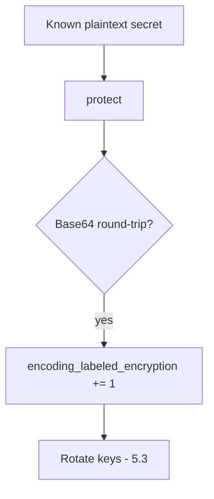

# 5.2-LO-06 — Detect known-plaintext encoding; treat as a leak

**Kind:** operations-exercise
**Loop step:** 6 Operate
**Standards:** NIST CSF 2.0 (final) DE/RS/RC as outcome labels; OWASP ASVS 5.0.0 (final) `v5.0.0-11.3.3`.

## Prevention is not absolute

A new encoding wrapper can land in a worker (7.4). Pair detect and recover. Do not log plaintext bodies (3.1).

## Mental model: CI is a detector



| Outcome | This module |
|---|---|
| Detect | known-plaintext Base64 in CI |
| Signal | field name, request id; never the body |
| Recover | Re-protect with AEAD; rotate keys |
| Residual | Memory dumps; authorized operators |

## Practice

Write one log line you would accept. Tie it to `labs/5.2/5.2-lab`.

```
log_denied reason=encoding_labeled_encryption field=body request_id=req_52cr
```

Reject any line that includes plaintext `secret` or a real SSN.

## Transfer

Clinic: detect Base64 SSN columns; do not paste values into the ticket.

## Non-goals

SIEM product names are not the property.
