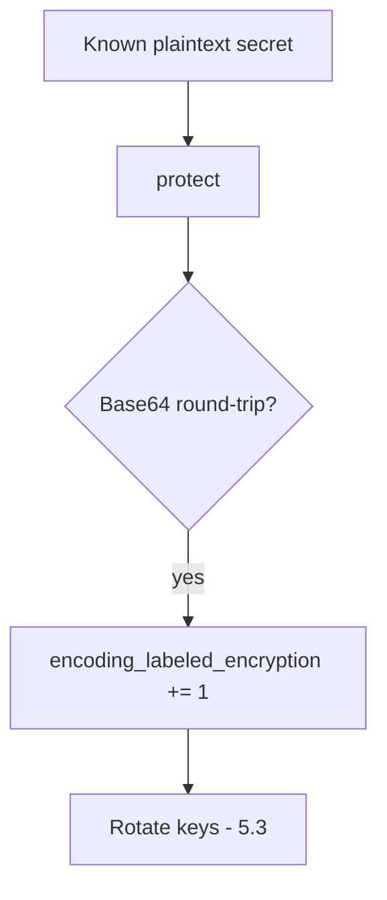

# 5.2-LO-06 — Detect known-plaintext encoding; treat as a leak

**Kind:** operations-exercise
**Loop step:** 6 Operate
**Standards:** NIST CSF 2.0 (final) DE/RS/RC as outcome labels; OWASP ASVS 5.0.0 (final) `v5.0.0-11.3.3`. CSF names outcomes; it does not encrypt the column.

## Prevention is not absolute

A new encoding wrapper can land in a worker (7.4) after `protect` was “fixed once.” Pair detect and recover. Do not log plaintext bodies (3.1). Do not paste an SSN into the ticket.

## Mental model: CI is a detector



| Outcome | This module |
|---|---|
| Detect | known-plaintext Base64 in CI |
| Signal | field name, request id; never the body |
| Recover | Re-protect with AEAD; rotate keys |
| Residual | Memory dumps; authorized operators who hold the key |

CSF 2.0 Detect / Respond / Recover name outcomes. They do not prove `v5.0.0-11.3.3`. A SIEM product name is not the property. Re-run `test_protect_is_not_mere_encoding` after any `protect` change; a green “encryption enabled” tile is not that pytest. Workers and export jobs are other paths of the same cell — inventory them before claiming Recover.

Recovery is incomplete if the next deploy still wraps `b64encode` in a helper named `encrypt`. Grep workers and export jobs for Base64 of known plaintext the same day you rotate keys (5.3), or the next backup re-issues the leak. A KMS dashboard is not that grep.

## Framework defaults versus the operate guarantee

A cloud KMS dashboard will show “CMK enabled” and stay silent when the column is still Base64. Detection must observe **the round-trip of a known plaintext**, not a product tile. If the alert includes plaintext `secret` or an SSN, you have opened a 3.1 cell.

## Practice

Write one log line you would accept. Tie it to `labs/5.2/5.2-lab`.

```text
log_denied reason=encoding_labeled_encryption field=body request_id=req_52cr
```

Reject any line that includes plaintext `secret`, a real SSN, or “AES handled.”

## Transfer

Clinic: detect Base64 SSN columns; do not paste values into the ticket. Do not query a live EHR.

## Non-goals

SIEM product names are not the property. Live column dumps are out of scope. Gates 0–10 stay not-attempted.
