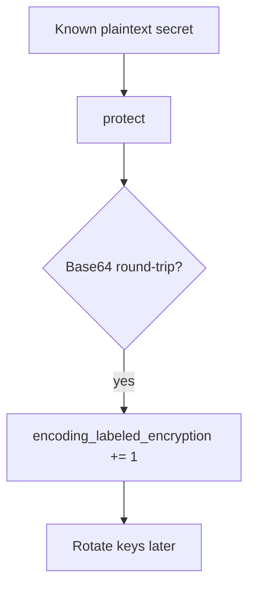

# Notice known-plaintext encoding; treat it as a leak

**Kind:** operations-exercise
**Loop step:** 6 Operate

## Fixing it once is not enough

Even after `protect` was “fixed once,” a new encoding wrapper can land in a worker. Running it for real is the rest of the loop: notice, contain, re-protect, and refuse to “help” by logging note bodies.

Do not log plaintext bodies. Do not paste an SSN into the ticket.

## Picture: CI is a detector

A known-plaintext Base64 hit is a notice-and-recover problem, not a licence to quote the body in the paging channel. Name the event when you notice it. Recover re-protects and rotates keys. Neither reprints the body.



A log product does not encrypt the column.

## Signals that do not become a second leak

| Outcome | This topic |
|---|---|
| Notice | known-plaintext Base64 in CI |
| What the line holds | field name, request id — **never** the body |
| Recover | Re-protect with authenticated encryption; rotate keys |
| Leftover | Memory dumps; operators who are allowed to hold the key |

```text
log_denied reason=encoding_labeled_encryption field=body request_id=req_52cr
```

Not: plaintext `secret`, a real SSN, or “AES handled.”

If your alert includes plaintext `secret` or an SSN, you have opened a second leak in the paging channel.

A green “encryption enabled” tile is not that check. Re-run `test_protect_is_not_mere_encoding` after any `protect` change. Workers and export jobs are other paths of the same rule — inventory them before claiming recover.

Recovery is incomplete if the next deploy still wraps `b64encode` in a helper named `encrypt`. Grep workers and export jobs for Base64 of known plaintext the same day you rotate keys, or the next backup re-issues the leak. A key-service dashboard is not that grep.

## What the framework does vs what you still have to check

A cloud key dashboard will show “key enabled” and stay silent when the column is still Base64. Detection must observe **the round-trip of a known plaintext**, not a product tile. If the alert includes plaintext `secret` or an SSN, you have opened a logging leak from an earlier lesson.

## Practice

For `labs/5.2/5.2-lab`, write a log line (ids, reason, no body). Reject any line that includes plaintext `secret`, a real SSN, or “AES handled.”

## Use it somewhere new

A clinic example: notice Base64 SSN columns; do not paste values into the ticket. Do not query a live clinic system.

## What this page is not doing

A vendor name is not this week's rule. Live column dumps are out of scope. This site does not mark you as finished. Answer keys are not on this site.
