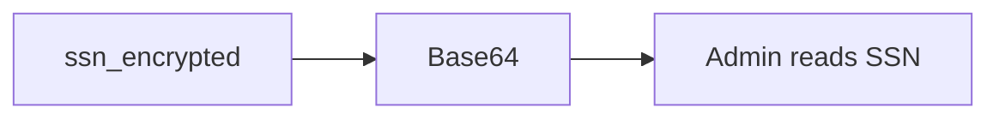

# 5.2-LO-07 — Transfer: SSN column labeled encrypted that is Base64

**Kind:** transfer-challenge
**Loop step:** 7 Transfer
**Standards:** OWASP ASVS 5.0.0 (final) `v5.0.0-11.3.3`; RFC 9106 (final) if a password row appears.

## Change the workplace; keep encoding-is-not-confidentiality

Do not answer with a Top 10 / CWE / scanner as the definition of security.

**Prompt:** Clinic: SSN column labeled “encrypted” that is Base64. Also name password hashing vs field AEAD vs backup encryption.

**Product sketch:** EHR-lite with an `ssn_encrypted` column.

Rewrite the SecureCollab sentence. Include:

1. attacker capabilities (DB admin; stolen disk — not a live clinic);
2. trust assumptions (which AEAD+key is TCB; the column name is not);
3. forbidden outcome (Base64 round-trip of the stand-in, not “HIPAA”);
4. a test idea on a **local** fixture only;
5. residual (key in the same row; nonce reuse Level 3; TLS ≠ at rest);
6. WCAG only if a human “show SSN” path is in the claim (masked until explicit view — `v5.0.0-14.2.6` is Level 3 elsewhere).

## Mental model: the label is not the mechanism

## What graders reject

| Reject | Why |
|---|---|
| “Disk encryption is on” | Wrong observer |
| Live clinic DB | Lab policy |
| Argon2 on the SSN | Wrong property |

## Practice

One page. No keys. `labs/5.2/5.2-lab` is the only running system you may break.
