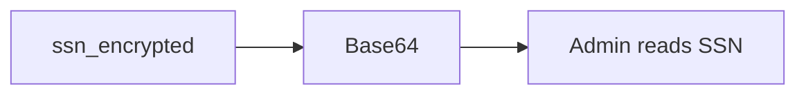

# A column labeled encrypted that is only Base64

**Kind:** transfer-challenge
**Loop step:** 7 Transfer

## Use it somewhere new

You get a **clinic SSN column**. The label on the column says encrypted. The bytes are Base64.

`protect("secret")` must not round-trip as Base64. For a clinic, encoding is not secrecy.

The SSN column labeled “encrypted” is Base64. Also name password hashing vs field encryption vs backup encryption.

A small clinic record with an `ssn_encrypted` column.

## Picture: the label is not the tool

The SSN is the secret in the column. A column named `ssn_encrypted` does not authorize leaving the bytes as Base64. A disk-encryption checkbox does not stop a round-trip decode.

| Notes app | Clinic sketch |
|---|---|
| `protect("secret")` | `protect` analogue on the SSN stand-in |
| Base64 of the body | Base64 of the SSN |
| Storage reader | Database admin; stolen disk — **not** a live clinic |
| Teaching flag `aesgcm:` | Column name `ssn_encrypted` is still not the tool |

If the column name is `ssn_encrypted` and the bytes are Base64, the rule is gone. FastAPI, a Postgres `bytea` type, and a disk-encryption checkbox do not invert the reader. Argon2 on the SSN is the wrong rule (password stretching, not field encryption). HTTPS does not encrypt the column.

Base64 decode of the stored stand-in is not the SSN. Renaming the column or wrapping `b64encode` in a function named `encrypt` leaves the reader unchanged. The local check is `test_protect_is_not_mere_encoding` — on a practice, not a live clinic system.

## Write this for a clinic SSN column

1. who might try (database admin; stolen disk — **not** a live clinic);
2. what you trust (which authenticated encryption plus key is trusted; the column name is not);
3. what must not happen (Base64 round-trip of the stand-in);
4. `protect(ssn)` must not round-trip as decode — **local** files (never on the real clinic);
5. leftover (key in the same row; nonce reuse is advanced; HTTPS is not at rest);
6. whether a human “show SSN” path must stay masked until an explicit view — do not use color as the only cue.

## What is not good enough

| Reject | Why |
|---|---|
| “Disk encryption is on” | Wrong reader |
| Live clinic database | Course rules |
| Argon2 on the SSN | Wrong rule |
| HTTPS as at-rest encryption | Wrong hop |
| HTTP 200 as secrecy evidence | Wrong observation |

## Practice

Treat a Base64 SSN column as not encrypted. Keep the answer keys closed. The only running system you may break is `labs/5.2/5.2-lab`. Do not decode a live column.

## What this page is not doing

Do not try live-target decoders. Do not use real SSNs. This page does not finish a check-in.
