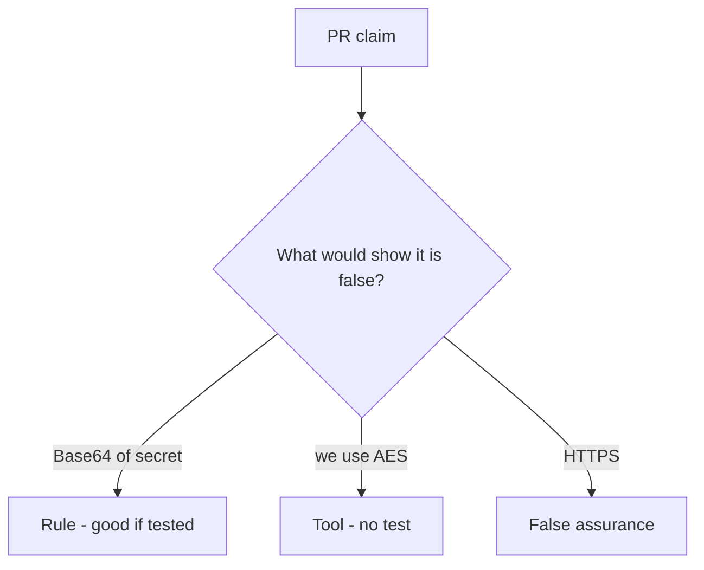

# Review of Base64 sold as encryption

**Kind:** code-review
**Loop step:** Review

## What you are reviewing

Review `labs/5.2/5.2-lab/vulnerable/` as a change to notes-app at-rest protection. Check whether Base64 decode of `protect("secret")` still equals `"secret"`.

Shipping “will add AES later” leaves `test_protect_is_not_mere_encoding` failing.

## Picture: protect equals base64

**`protect = base64`**.

Decode still cannot be the plaintext. If `protect` never uses a keyed, non-encoding transform, that reversible leftover is still open. A comment that says AES without a round-trip test is tool theater.

## Problems to find (name them yourself)

- `protect = base64`
- AES-ECB “because we need it deterministic”
- JWT as encryption
- No `looks_encrypted` test

Also reject: rolling a cipher; closing findings without re-running `test_protect_is_not_mere_encoding`; keys in learner notes; real people's data in the practice files; HTTPS as at-rest encryption.

## Common mix-ups

- HTTPS means data at rest is encrypted
- Base64 is hashing
- Stronger algorithm fixes a bad key story
- Column rename is secrecy
- Argon2 belongs on the note body

## Use it somewhere new

Renaming a column to `ssn_encrypted` without a reversibility test still leaves Base64. What still has to fail so Base64 cannot round-trip the SSN?

## What this page is not doing

Base64 named as AES, plus “will add AES later,” is leftover with no owner. Do not decode a live column to prove the finding.
