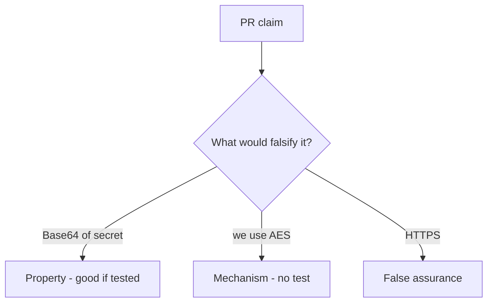

# 5.2-LO-08 — Review Base64-as-encryption as a PR, not a crypto ticket

**Kind:** code-review
**Loop step:** Review
**Standards:** OWASP ASVS 5.0.0 (final) `v5.0.0-11.3.3`.

## Review the fixture as if it were SecureCollab at-rest protection

Review `labs/5.2/5.2-lab/vulnerable/` as a SecureCollab PR. Intended findings live only in `content/assessment/keys/5.2.md` — not here.

## Mental model: property, mechanism, or false assurance

Seeded smells (label them yourself; do not open the keys file):

- `protect = base64`
- AES-ECB “because we need it deterministic”
- JWT as encryption
- No `looks_encrypted` test

Also reject: rolling a cipher, keys in lessons, real PII in fixtures.

## Misconceptions

- HTTPS means data at rest is encrypted
- Base64 is hashing
- Stronger algorithm fixes a bad key story

## Practice

Write three review notes. Tie at least one to `test_protect_is_not_mere_encoding`.

## Transfer

Clinic PR that renames a column to `ssn_encrypted` without a reversibility test is incomplete.
