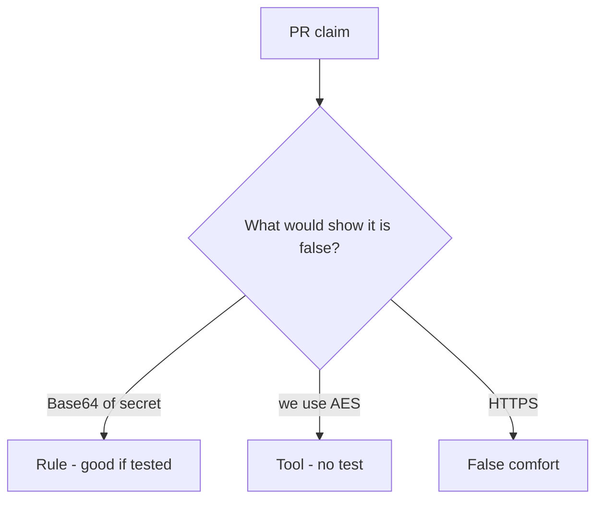

# Review of Base64 sold as encryption

**Kind:** code-review
**Loop step:** Review

Intended findings live only in the answer-key folder — not here. Do not open that file until your review has been evaluated.

## What you are reviewing

A colleague ships notes-app at-rest protection. Review `labs/5.2/5.2-lab/vulnerable/` as that change. Your job is not to count suspicious lines. Reconstruct whether Base64 decode of `protect("secret")` still equals `"secret"`, compare that with the rule, and write changes a developer can verify.

The check you already ran (`test_protect_is_not_mere_encoding`) is the rule test. A comment “will add AES later” is not.

## Picture: protect equals base64

Start with this seeded smell: **`protect = base64`**. Label it rule, tool, or false comfort before you accept the change.

The review starts at the protected effect (decode is not the plaintext). Everything that is not a keyed, non-encoding transform at `protect` is a candidate reversible path. A comment that says AES without a round-trip test is tool theater, not a different finding class.

## Problems to find (name them yourself)

- `protect = base64`
- AES-ECB “because we need it deterministic”
- JWT as encryption
- No `looks_encrypted` test

Also reject: rolling a cipher; closing findings without re-running `test_protect_is_not_mere_encoding`; keys in learner notes; real people's data in the practice files; HTTPS as at-rest encryption.

## Common mix-ups

- HTTPS means data at rest is encrypted
- Base64 is hashing
- Stronger algorithm fixes a bad key story
- Column rename is secrecy
- Argon2 belongs on the note body

## Practice

Write three review notes a maintainer could act on. Each note: what you saw, rule or false comfort, suggested structural change, leftover you will **not** delete. Tie at least one note to `test_protect_is_not_mere_encoding`. Do not open the keys file.

## Use it somewhere new

Clinic change that renames a column to `ssn_encrypted` without a reversibility test is an incomplete review. Name the independent falsehood that would still keep Base64 from round-tripping the SSN.

## What this page is not doing

Do not merge by adding a comment “will add AES later.” That comment is leftover without an owner. Do not decode a live column to prove the finding.
