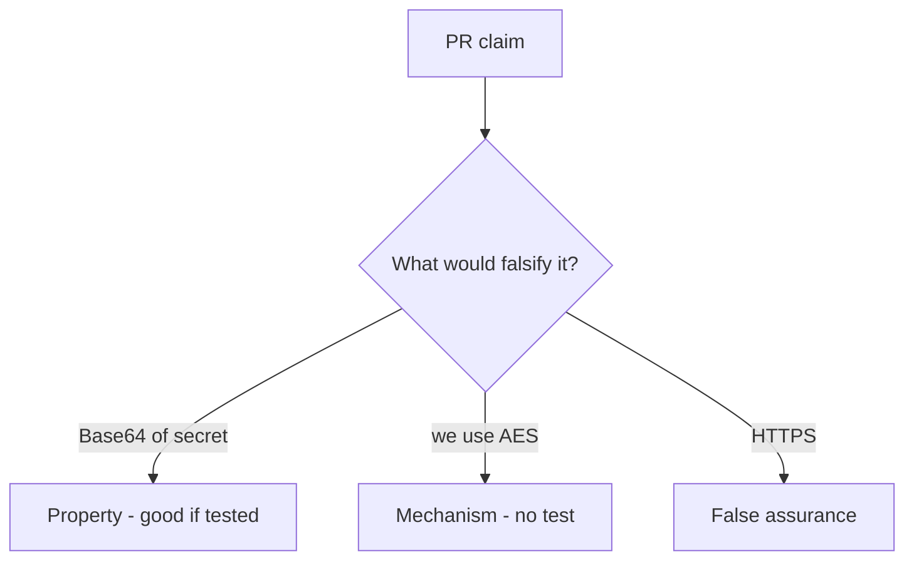

# 5.2-LO-08 — Review Base64-as-encryption as a PR, not a crypto ticket

**Kind:** code-review
**Loop step:** Review
**Standards:** OWASP ASVS 5.0.0 (final) `v5.0.0-11.3.3`.

## Review the fixture as if it were SecureCollab at-rest protection

Review `labs/5.2/5.2-lab/vulnerable/` as a SecureCollab PR. Your job is not to count suspicious lines. Reconstruct whether Base64 decode of `protect("secret")` still equals `"secret"`, compare that with the module invariant, and write changes a developer can verify.

Intended findings live only in `content/assessment/keys/5.2.md` — not here. Do not open the keys file until your review has been evaluated.

## Mental model: protect = base64

Start with this seeded smell: **`protect = base64`**. Label it property, mechanism, or false assurance before you accept the PR.

Classification starts at the protected effect (decode is not the plaintext). Everything that is not a keyed, non-encoding transform at `protect` is a candidate reversible path. A comment that says AES without a round-trip test is mechanism theater, not a different finding class.

## Seeded smells (label them yourself)

- `protect = base64`
- AES-ECB “because we need it deterministic”
- JWT as encryption
- No `looks_encrypted` test

Also reject: rolling a cipher; closing findings without re-running `test_protect_is_not_mere_encoding`; keys in lessons; real PII in fixtures; HTTPS as at-rest encryption.

## Misconceptions this module refuses

- HTTPS means data at rest is encrypted
- Base64 is hashing
- Stronger algorithm fixes a bad key story
- Column rename is confidentiality
- Argon2 belongs on the note body

## Practice

Write three review notes a maintainer could act on. Each note: observation, property or false assurance, suggested structural change, residual you will **not** delete. Tie at least one to `test_protect_is_not_mere_encoding`.

## Transfer

Clinic PR that renames a column to `ssn_encrypted` without a reversibility test is an incomplete mediation review. Name the independent falsehood that would still keep Base64 from round-tripping the SSN.

## Non-goals

Do not merge by adding a comment “will add AES later.” That comment is a residual without an owner. Do not decode a live column to prove the finding.
