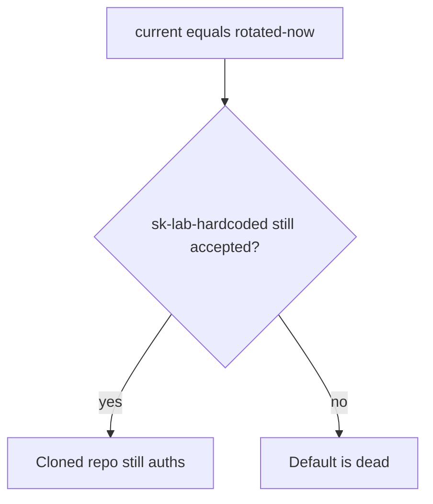
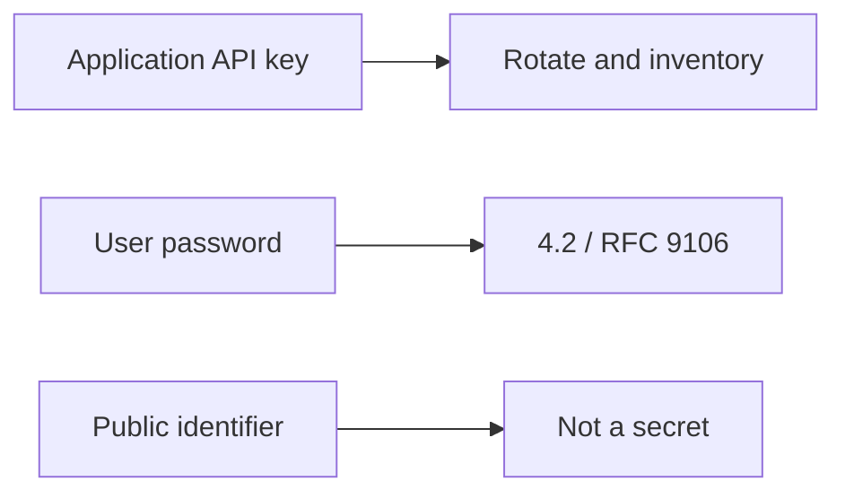

# 5.3-LO-01 — A rotated secret must kill the hardcoded default

**Kind:** concept-model
**Loop step:** 1 Property
**Standards:** OWASP ASVS 5.0.0 (final) `v5.0.0-13.3.1`, `v5.0.0-13.2.3`, `v5.0.0-11.1.1`; `v5.0.0-13.3.4` and `v5.0.0-13.3.3` are **Level 3, advanced**. pydantic Settings is not this sentence. NIST PQC is agility planning, not a lab quantum attack.

## The claim this module owns

SecureCollab Phase 1 uses an application API key distinct from user passwords (4.2) and public identifiers. A disposable lab string `sk-lab-hardcoded` in source is a default credential. After rotation to `current="rotated-now"`, that default must not authenticate. A secrets-manager sticker is not rotation.

> `auth("sk-lab-hardcoded", current="rotated-now")` must be false. Missing `current` must deny. Inventory + rotation is complete mediation over time, like 4.1 leftover sessions.

The forbidden outcome is **old hardcoded default still authenticates after rotation**. That is a 1.1 authenticity failure of the service credential; 1.2 then runs as whoever holds the clone.

ASVS `v5.0.0-13.3.1` wants secrets created and stored outside source and build artifacts (L3 adds HSM — **advanced**, not this lab). `v5.0.0-13.2.3` wants no default credentials. `v5.0.0-11.1.1` wants a key lifecycle. `v5.0.0-13.3.4` (expire/rotate on a schedule) and `v5.0.0-13.3.3` (isolated HSM for crypto ops) are **Level 3 (advanced)**.

## Mental model: the secret outlives rotation



The attacker cloned the repo or an old image. Trusting `.gitignore` or “we use Vault” without a rotation test is not a TCB.

**Mechanism (not the property):** AWS Secrets Manager, pydantic Settings, or a `.env` file.

## Mental model: three secret classes



Mixing classes is how a tenant id becomes a “key” or a password becomes a service credential.

## Root cause vs impact vs prevention vs detection vs recovery

| Slice | For this property |
|---|---|
| Root cause | Default credential never invalidated |
| Preconditions | `auth(hardcoded)` true while `current` is rotated |
| Trigger | Clone presents `sk-lab-hardcoded` |
| Impact | Authenticity of the service credential over time |
| Prevention | Unique secrets; rotate; refuse known defaults; never commit |
| Detection | `default_secret_used`; secret scanning |
| Recovery | Rotate again; rebuild images; purge logs |

## Framework defaults versus the rotation guarantee

pydantic Settings reading `.env` does not rotate anything. Vault without a rotation test is a new dump. Oracle: `labs/5.3/5.3-lab`. No live KMS. The lab string is disposable.

## Mechanism limits

- Secondary default in a worker (7.4); mobile embedded key (8.4).
- Envelope DEK vs KEK is named, not executed.
- PQC migration is a plan (`v5.0.0-11.1.4` in 5.2), not this test.

## Practice

Inventory: name, location, owner, last rotated, blast radius. Then run:

```
python3 -m pytest labs/5.3/5.3-lab/tests --impl vulnerable
python3 -m pytest labs/5.3/5.3-lab/tests --impl fixed
```

The first command must fail. The second must pass.

## Transfer

Clinic lab API key in a gist. Envelope DEK vs KEK compromise runbook.

## Non-goals

Live cloud keys, real production secrets, quantum attack scripts. Gates 0–10 and milestones M0–M5 stay **not-attempted**. Answer keys are not in this file.
