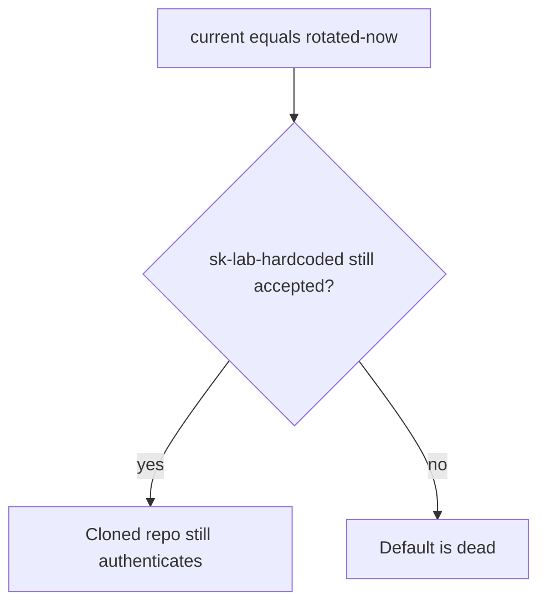
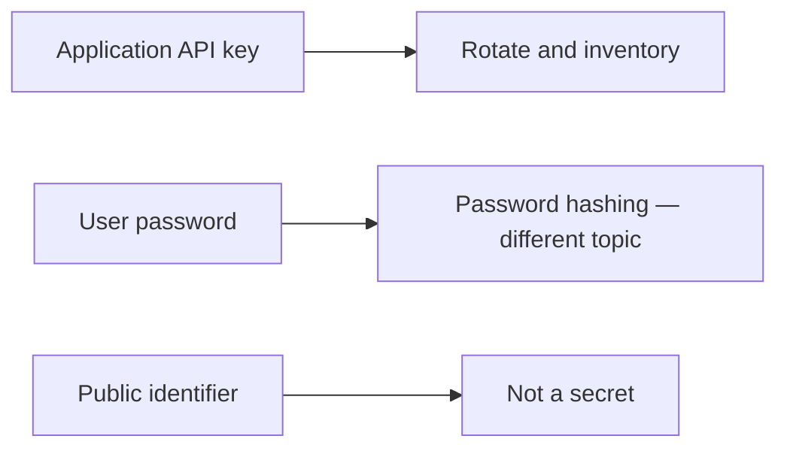

# A rotated secret must kill the hardcoded default

**Kind:** concept-model
**Loop step:** 1 Property

## The rule

The notes app uses an application API key. That key is not a user password, and it is not a public id like a tenant name. A disposable practice string `sk-lab-hardcoded` sitting in source is a default credential. After you rotate to `current="rotated-now"`, that default must not authenticate. A secrets-manager sticker is not rotation.

> `auth("sk-lab-hardcoded", current="rotated-now")` must be false. Missing `current` must deny. An inventory plus a rotation check is leftover-path coverage over time — like an old session that still works after logout.

What must not happen is **the old hardcoded default still authenticates after rotation**. The service credential is treated as current even though you meant to kill it. Then who-is-allowed runs as whoever holds the clone.

Secrets have to be created and stored outside source and build artifacts. There should be no default credentials. There has to be a key lifecycle. Timed rotation and a hardware box for crypto are advanced extras, not this check. A Python settings library reading `.env` is not this sentence. Planning for post-quantum crypto is agility planning, not a lab quantum attack.

## Picture: the secret outlives rotation



The attacker cloned the repo or an old image. Trusting `.gitignore` or “we use Vault” without a rotation test is not what you trust.

**A tool is not the rule.** AWS Secrets Manager, a Python settings library, or a `.env` file.

## Picture: three secret classes



Mixing classes is how a tenant id becomes a “key,” or a password becomes a service credential.

## Why it happens, what it costs, how you stop it, how you notice, how you recover

| Slice | For this rule |
|---|---|
| Why it happens | Default credential never invalidated |
| What has to be true first | `auth(hardcoded)` is true while `current` is rotated |
| Trigger | Clone presents `sk-lab-hardcoded` |
| What it costs | Authenticity of the service credential over time |
| How you stop it | Unique secrets; rotate; refuse known defaults; never commit |
| How you notice | `default_secret_used`; secret scanning |
| How you recover | Rotate again; rebuild images; purge logs |

## What the framework does vs what you still have to check

A settings library reading `.env` does not rotate anything. Vault without a rotation test is a new dump. What this practice is supposed to show: `labs/5.3/5.3-lab`. No live key service. The lab string is disposable.

## What the tool cannot do

- A second default on a worker (later topic); a key baked into a phone app (later topic).
- Envelope wrapping (a data key vs a wrapping key) is named, not executed.
- A post-quantum migration plan is a plan, not this test.

## Practice

Inventory: name, location, owner, last rotated, blast radius. Then run:

```text
python3 -m pytest labs/5.3/5.3-lab/tests --impl vulnerable
python3 -m pytest labs/5.3/5.3-lab/tests --impl fixed
```

The first command must fail. The second must pass.

## Use it somewhere new

Clinic lab API key in a gist. Envelope wrapping (data key vs wrapping key) on compromise.

## What this page is not doing

Live cloud keys, real production secrets, quantum attack scripts. This site does not mark you as finished. Answer keys are not on this site.
