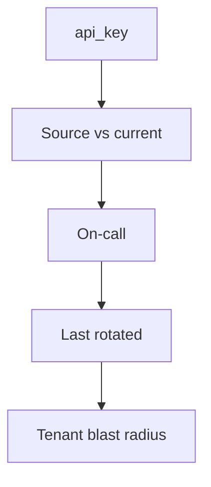
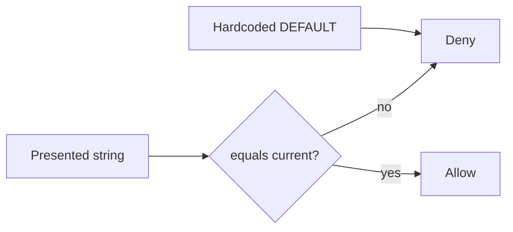

# 5.3-LO-02 — A secret inventory a second engineer can test

**Kind:** design-exercise
**Loop step:** 2 Model
**Standards:** OWASP ASVS 5.0.0 (final) `v5.0.0-13.3.1` and `v5.0.0-11.1.1`.

## Can a second engineer name pytest cases from your inventory?

“We have a vault” is not this lesson. A reviewable model names **each secret, where it lives, who owns rotation, and what happens to the old value**.

SecureCollab Phase 1 freeze: local `auth(presented, current)`. Disposable `sk-lab-hardcoded`. No live vault.

## Mental model: inventory row

A missing row is how a worker default survives (7.4).

## Mental model: current is the only acceptor

## Step 1: freeze pieces

| Piece | This system |
|---|---|
| Subjects | service; repo-clone attacker |
| Objects | current API key; hardcoded default |
| Actions | `auth` |
| Channels | header stand-in |
| TCB | Current-only compare; fail closed if current missing |
| Untrusted | Source DEFAULT; “Vault is on” |
| State / time | After rotation |
| 1.1 cell | Authenticity over time |

## Step 2: write cells

| Subject | Object | Action | Decision |
|---|---|---|---|
| client | current `rotated-now` | auth | allow |
| clone | `sk-lab-hardcoded` | auth after rotate | deny |
| anyone | presented with current None | auth | deny |

## Practice

Draw the inventory. Point at `labs/5.3/5.3-lab` file `secrets.py`.

## Transfer

Envelope DEK vs KEK; gist leak.

## Residual risk

Images already shipped; logs that captured the old value; HSM (`v5.0.0-13.3.3` Level 3 advanced).

## Non-goals

Top 10 as the definition of security. Keys stay out of lessons.
