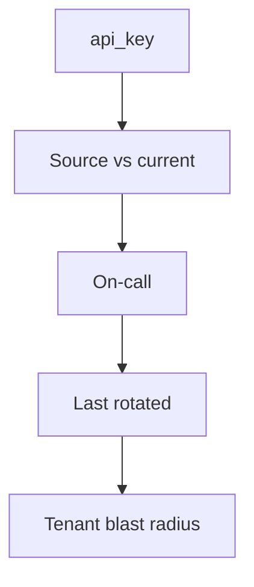
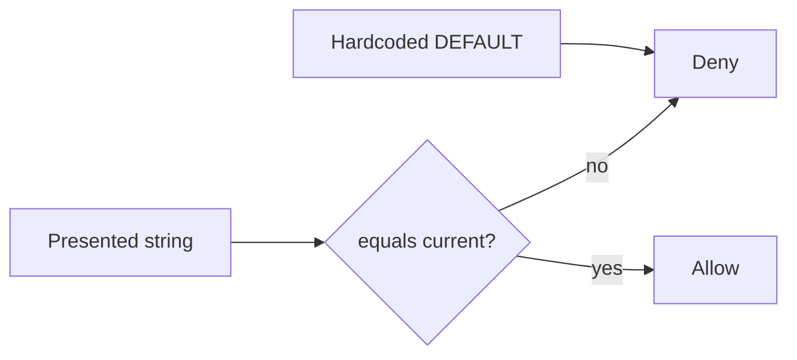

# A secret inventory someone else can test

**Kind:** design-exercise
**Loop step:** 2 Model

## Could someone else name the checks from your inventory?

“We have a vault” is not this page. A reviewable model names **each secret, where it lives, who owns rotation, and what happens to the old value**.

This week’s freeze: local `auth(presented, current)`. Disposable `sk-lab-hardcoded`. No live vault.

## Picture: inventory row

A missing row is how a worker default survives (later topic).

## Picture: current is the only acceptor

## Step 1: freeze who, what, and time

| Piece | This system |
|---|---|
| Who | service; repo-clone attacker |
| What | current API key; hardcoded default |
| Actions | `auth` |
| Paths | header stand-in |
| What you trust | Current-only compare; deny if current is missing |
| What you do not trust | Source DEFAULT; “Vault is on” |
| State / time | After rotation |
| The rule | Authenticity over time |

## Step 2: write rows the lab can fail

| Who | What | Action | Decision |
|---|---|---|---|
| client | current `rotated-now` | auth | allow |
| clone | `sk-lab-hardcoded` | auth after rotate | deny |
| anyone | presented with current None | auth | deny |

## Practice

Draw the inventory so someone else could name the checks. Point at `labs/5.3/5.3-lab` file `secrets.py`.

## Use it somewhere new

Envelope wrapping (data key vs wrapping key); gist leak.

## What can still go wrong

Images already shipped; logs that captured the old value; a hardware box for crypto (advanced extra).

## What this page is not doing

Treating an awareness list as the definition of security. Answer keys are not on this site.
