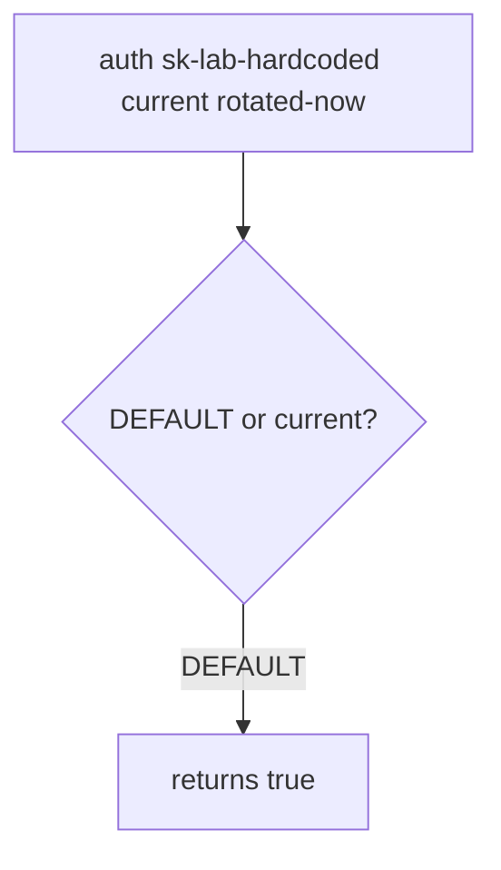

# 5.3-LO-03 — Observe the leftover default, do not trophy a live key

**Kind:** mechanism-lab
**Loop step:** 3 Break
**Standards:** OWASP ASVS 5.0.0 (final) `v5.0.0-13.2.3`. `v5.0.0-13.3.3` / `v5.0.0-13.3.4` are **Level 3, advanced**, not this pytest.

## Authorized scope

`labs/5.3/5.3-lab` only. The fixture is an in-process `auth`. Disposable `sk-lab-hardcoded` and `rotated-now`. It does not open a vault or a cloud IAM API. Do not search public GitHub, an employer gist, or a classmate repo as this exercise.

**Forbidden outcome:** old hardcoded default still authenticates after rotation. `auth("sk-lab-hardcoded", current="rotated-now")` returns true.

Attacker capability in this lab: a reader of the cloned repo, an old container image, or a gist copy of `DEFAULT`. That stands in for a clinic lab API key that was “rotated in the wiki” while the default or-clause stayed. Trust assumption: `auth` is supposed to accept only the current secret and deny when current is missing. A vault brand, `.gitignore`, and “we rotated” in a ticket are not in the TCB for this cell.

## Mental model: DEFAULT still wins



The vulnerable tree demonstrates **cause** (default never died), not a scan of GitHub for real keys. Preconditions: `auth` returns true if `current` is missing (fail open) **or** if presented equals `DEFAULT` **or** `current`. You do not need a live key. You must not search for one.

ASVS `v5.0.0-13.2.3` wants no default credentials. A secrets-manager sticker is not that cell.

## What to read in the fixture

`vulnerable/secrets.py` `auth` keeps `DEFAULT = "sk-lab-hardcoded"` as an or-clause and fails open when `current` is missing. Tests:

- `test_hardcoded_default_does_not_auth`
- `test_missing_current_denies`
- `test_current_secret_authenticates` — honest path on both trees if current matches

You do not need a new key string. The failure of `test_hardcoded_default_does_not_auth` *is* the evidence.

Do not open the fixed tree yet. Diagnose the cause first.

## Root cause vs impact vs prevention vs detection vs recovery

| Slice | This lab |
|---|---|
| Required property | Hardcoded default is dead after rotation |
| Root cause | Default credential never invalidated; missing current fails open |
| Preconditions | `auth` accepts `DEFAULT` or missing `current` |
| Trigger | `auth("sk-lab-hardcoded", current="rotated-now")` |
| Impact | Authenticity of the service credential; then 1.2 as whoever holds the clone |
| Prevention | Authenticate only `presented == current`; deny if current missing |
| Detection | `default_secret_used` by secret id, never the value |
| Recovery | Rotate; rebuild images; purge logs that held the value |
| Not the lesson | A vault product name, gitignore, or a live gist search |

## Framework defaults versus the rotation guarantee

pydantic Settings will still load a default if you leave one in code. FastAPI `Depends` does not rotate. A vault dashboard tile does not pop `DEFAULT`. The application guarantee is: **this** fixture, `auth("sk-lab-hardcoded", current="rotated-now") is False`.

## Practice

```text
python3 -m pytest labs/5.3/5.3-lab/tests --impl vulnerable
```

Record `test_hardcoded_default_does_not_auth`. Do not search public GitHub. An environment error is not security evidence.

## Transfer

Clinic gist of a lab API key. Predict without leaving this directory. Do not fetch a live gist.

## Non-goals

No live-target instructions. Disposable lab strings only.
