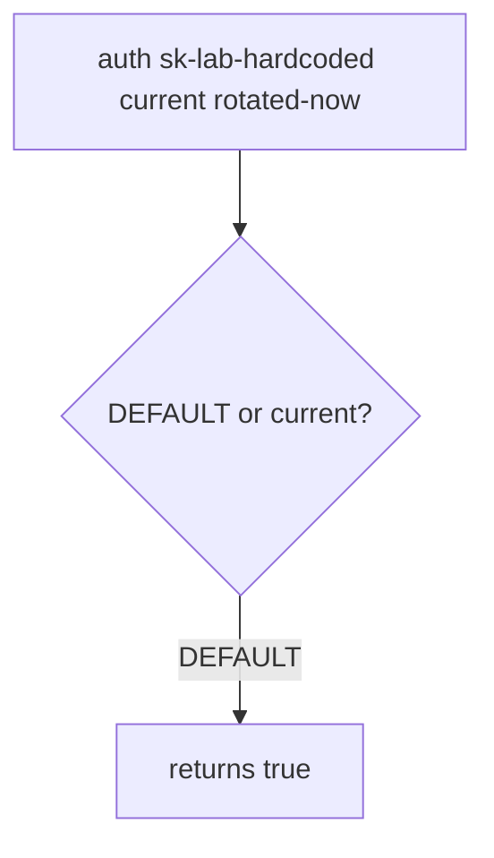

# 5.3-LO-03 — Observe the leftover default, do not trophy a live key

**Kind:** mechanism-lab
**Loop step:** 3 Break
**Standards:** OWASP ASVS 5.0.0 (final) `v5.0.0-13.2.3`.

## Authorized scope

`labs/5.3/5.3-lab` only. Disposable `sk-lab-hardcoded`. No live cloud.

**Forbidden outcome:** Old hardcoded default still authenticates after rotation.

## Mental model: DEFAULT still wins



The vulnerable tree demonstrates **cause** (default never died), not a scan of GitHub for real keys.

## What to read in the fixture

`vulnerable/secrets.py` `auth` returns true if `current` is missing (fail open) or if presented equals `DEFAULT` **or** `current`. Tests require the default false after rotation, current true, and missing current false.

## Root cause vs impact

| Slice | Lab |
|---|---|
| Root cause | Default credential never invalidated |
| Impact | Cloned repo still authenticates |
| Not the lesson | A vault product name as the definition |

## Practice

```
python3 -m pytest labs/5.3/5.3-lab/tests --impl vulnerable
```

Record `test_hardcoded_default_does_not_auth`. Do not search public GitHub.

## Transfer

Clinic gist. Predict without leaving this directory.

## Non-goals

No live-target instructions. Synthetic data only.
