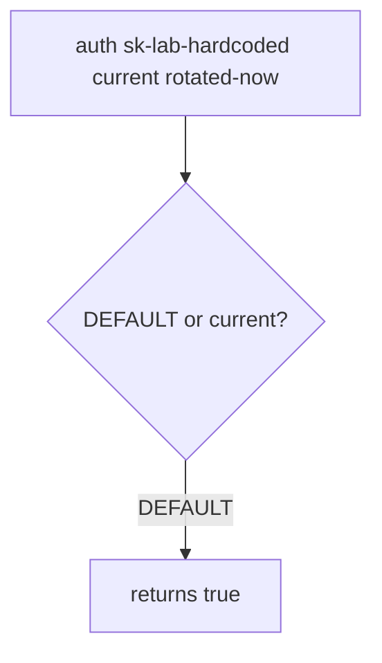

# Practice: the hardcoded default still works after rotation

**Kind:** mechanism-lab
**Loop step:** 3 Break

## Try it

The practice is not a website you attack. It is a tiny in-process `auth`. Disposable `sk-lab-hardcoded` and `rotated-now`. It does not open a vault or a cloud identity API. An old hardcoded default still counting as a valid key after rotation is a **failed rule**, not a hunt for a live key.

> A rotated secret must kill the hardcoded default. `auth("sk-lab-hardcoded", current="rotated-now")` must be false.

## Where you may practice

Stay inside `labs/5.3/5.3-lab`. Restore the broken and repaired folders when you are done. Disposable lab strings only.

Do not search public GitHub, an employer gist, or a classmate repo as this exercise.

What must not happen: the old hardcoded default still authenticates after rotation. `auth("sk-lab-hardcoded", current="rotated-now")` returns true.

Who could do this: a **reader of the cloned repo**, an old container image, or a gist copy of `DEFAULT`. That stands in for a clinic lab API key that was “rotated in the wiki” while the default or-clause stayed. What is supposed to stop this: `auth` accepts only the current secret and denies when current is missing. A vault brand, `.gitignore`, and “we rotated” in a ticket are not enough.

## Picture: DEFAULT still wins



The broken files show **cause** (the default never died), not a scan of GitHub for real keys. What has to be true first: `auth` returns true if `current` is missing (allow when it should deny) **or** if presented equals `DEFAULT` **or** `current`. You do not need a live key. You must not search for one.

A secrets-manager sticker is a tool observation, not that sentence.

## What to look at: the cause, not a hunt

Open `vulnerable/secrets.py`. `auth` keeps `DEFAULT = "sk-lab-hardcoded"` as an or-clause and allows when `current` is missing. Checks:

- `test_hardcoded_default_does_not_auth`
- `test_missing_current_denies`
- `test_current_secret_authenticates` — honest path on both trees if current matches

You do not need a new key string.
## Why it happens, what it costs, how you stop it, how you notice, how you recover

| Slice | This practice |
|---|---|
| The rule | Hardcoded default is dead after rotation |
| Why it happens | Default credential never invalidated; missing current allows |
| What has to be true first | `auth` accepts `DEFAULT` or missing `current` |
| Trigger | `auth("sk-lab-hardcoded", current="rotated-now")` |
| What it costs | Authenticity of the service credential; then who-is-allowed as whoever holds the clone |
| How you stop it | Authenticate only `presented == current`; deny if current is missing |
| How you notice | `default_secret_used` by secret id, never the value |
| How you recover | Rotate; rebuild images; purge logs that held the value |
| Not the lesson | A vault product name, gitignore, or a live gist search |

## What the framework does vs what you still have to check

A settings library will still load a default if you leave one in code. FastAPI `Depends` does not rotate. A vault dashboard tile does not pop `DEFAULT`. What this practice is supposed to show: `auth("sk-lab-hardcoded", current="rotated-now")` is False.

## Practice

```text
python3 -m pytest labs/5.3/5.3-lab/tests --impl vulnerable
```

Do not search public GitHub. A setup error is not proof the rule holds.

## Use it somewhere new

Clinic gist of a lab API key. Predict without leaving this directory. Do not fetch a live gist.

## What this page is not doing

No live-target instructions. Disposable lab strings only.
