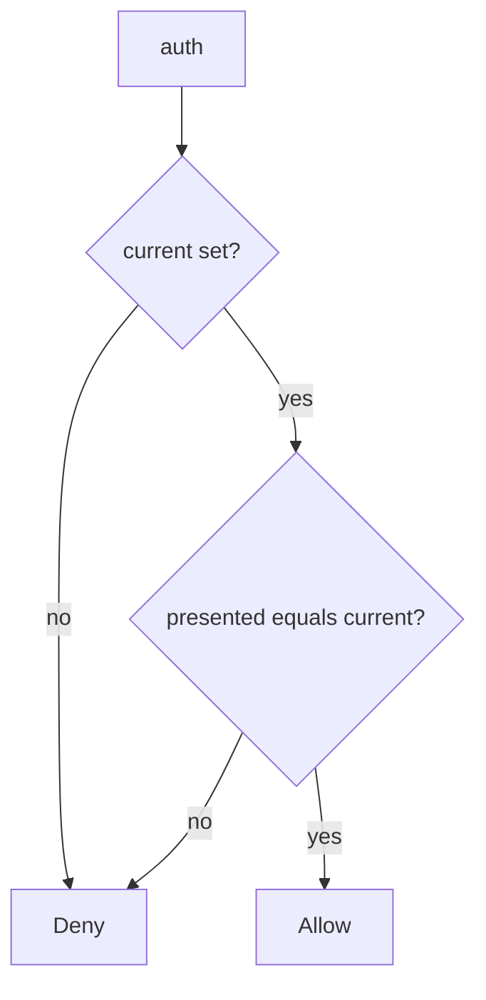

# Authenticate only the current secret

**Kind:** design-exercise
**Loop step:** 4 Build

## The rule

`auth` must require a truthy `current` and equality with `presented`. Structural means the old value is dead — not `.gitignore`, not a vault brand, not “we rotated in the wiki,” not a comment that says TODO remove default.

The smallest restore for notes-app service credentials is: current only, deny if current is missing. Do not fall back to `DEFAULT`. Do not allow because “the vault was unreachable.”

## Picture: current only, deny if missing



The lab’s repaired files are `bool(current) and presented == current`. Production still needs the secret created outside source, and a rebuild of images that shipped the old string. User-password lifecycle is a different authenticator. A hardware box for crypto is an advanced extra, not this check.

There should be no default credentials. This week's check covers `auth`.

## What the repaired files must show

| After the fix | Must be true |
|---|---|
| current `rotated-now` | authenticates |
| `sk-lab-hardcoded` after rotate | deny |
| current None | deny |

## What this is not

Vault without a test. Same key for all tenants. Password lifecycle (a different authenticator). gitignore as revocation. A key-service dashboard as rotation. Envelope wrapping (data key vs wrapping key) as this check.

## What can still go wrong

- Copies already cloned still hold the old string until they are rebuilt.
- A second default on a worker is another path of the same rule (later topic).
- Keys baked into a phone app wait for a later topic.
- Timed rotation (advanced extra) is not this practice.
- A hardware box for crypto (advanced extra) is not this practice.

## Practice

Name the check (`current` truthy and `presented == current`). Run:

```text
python3 -m pytest labs/5.3/5.3-lab/tests --impl fixed
```

It must pass.

## Use it somewhere new

A clinic example: rotate the gist-leaked key and prove the old string fails, including missing-current deny.

## What this page is not doing

Do not search live gists. Do not claim a course gate from a vault product name.
