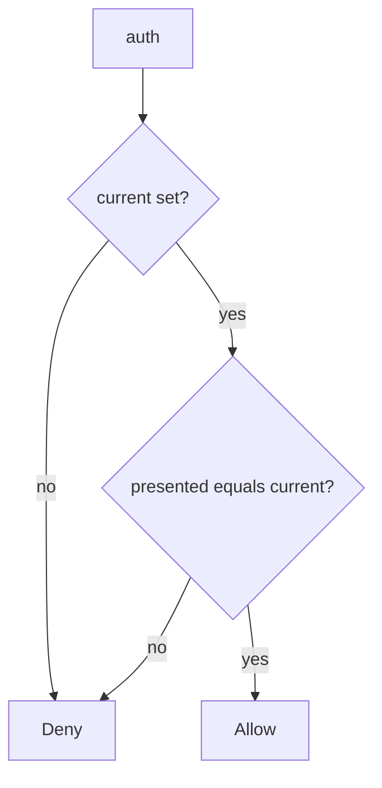

# 5.3-LO-04 — Authenticate only the current secret

**Kind:** design-exercise
**Loop step:** 4 Build
**Standards:** OWASP ASVS 5.0.0 (final) `v5.0.0-13.3.1` and `v5.0.0-13.2.3`.

## Structural means the default is not an or-clause

`auth` must require a truthy `current` and equality with `presented`. Structural means the old value is dead — not `.gitignore`, not a vault brand, not “we rotated in the wiki.”

## Mental model: current only, fail closed



Fail-safe: missing current **denies**. Do not fall back to `DEFAULT`.

## Why this restores the cell

| After the fix | Must be true |
|---|---|
| current `rotated-now` | authenticates |
| `sk-lab-hardcoded` after rotate | deny |
| current None | deny |

## What this is not

Vault without a test. Same key for all tenants. Password lifecycle (4.2).

## Practice

Name predicate. Run:

```
python3 -m pytest labs/5.3/5.3-lab/tests --impl fixed
```

Must pass.

## Transfer

Clinic: rotate the gist-leaked key and prove the old string fails.

## Residual risk

Shipped images; scheduled rotation (`v5.0.0-13.3.4` Level 3 advanced) is not this fixture.
