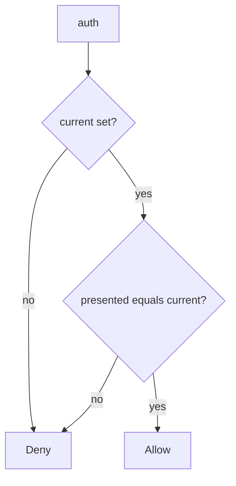

# 5.3-LO-04 — Authenticate only the current secret

**Kind:** design-exercise
**Loop step:** 4 Build
**Standards:** OWASP ASVS 5.0.0 (final) `v5.0.0-13.3.1` and `v5.0.0-13.2.3`. `v5.0.0-13.3.3` and `v5.0.0-13.3.4` are **Level 3, advanced**.

## Structural means the default is not an or-clause

`auth` must require a truthy `current` and equality with `presented`. Structural means the old value is dead — not `.gitignore`, not a vault brand, not “we rotated in the wiki,” not a comment that says TODO remove default.

The smallest restore for SecureCollab Phase 1 service credentials is: current only, fail closed. Fail-safe: missing current **denies**. Do not fall back to `DEFAULT`. Do not fail open because “the vault was unreachable.”

## Mental model: current only, fail closed



The lab’s fixed tree is `bool(current) and presented == current`. Production still needs the secret created outside source (`v5.0.0-13.3.1`) and a rebuild of images that shipped the old string. Password lifecycle (4.2) is a different authenticator. HSM isolation is Level 3 advanced, not this pytest.

ASVS `v5.0.0-13.2.3` wants no default credentials. This pytest is that sentence for `auth`.

## Why this restores the cell

| After the fix | Must be true |
|---|---|
| current `rotated-now` | authenticates |
| `sk-lab-hardcoded` after rotate | deny |
| current None | deny |

## What this is not

Vault without a test. Same key for all tenants. Password lifecycle (4.2). gitignore as revocation. KMS dashboard as rotation. Envelope DEK/KEK as this pytest.

## Mechanism limits

- Copies already cloned still hold the old string until they are rebuilt.
- Worker second defaults (7.4) are another path of the same cell.
- Mobile embedded keys wait for 8.4.
- Scheduled rotation (`v5.0.0-13.3.4` Level 3 advanced) is not this fixture.
- HSM (`v5.0.0-13.3.3` Level 3 advanced) is not this fixture.

## Practice

Name predicate (`current` truthy ∧ `presented == current`). Run:

```text
python3 -m pytest labs/5.3/5.3-lab/tests --impl fixed
```

Must pass.

## Transfer

Clinic: rotate the gist-leaked key and prove the old string fails, including missing-current deny.

## Residual risk

Shipped images; log copies of the value; worker second default; scheduled rotation as a substitute for killing `DEFAULT`.

## Non-goals

Do not search live gists. Do not claim Gate 5 from a vault product name.
