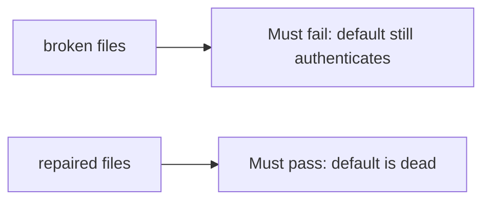

# A leftover default secret must fail

**Kind:** verification-lab
**Loop step:** 5 Verify

## Check it

“Secrets Manager is enabled” is not this topic’s evidence. “The wiki says we rotated” is a tool observation. The check is: `auth("sk-lab-hardcoded", current="rotated-now")` is False and `auth("rotated-now", current=None)` is False. That observation must be **false** on the broken files (default still authenticates / missing current allows) and **true** on the repaired files.

## Picture: leftover default must fail

A passing-test tally can still hide that a leftover default still counts as a valid key.



| Mode | Must show for this topic |
|---|---|
| Normal | current secret authenticates (`test_current_secret_authenticates`; may pass on both) |
| Wrong input / abuse | hardcoded default false after rotate; missing current denies; broken files must fail |
| Not claimed | hardware box; timed rotation; worker second default |

The checks are in `labs/5.3/5.3-lab/tests/test_property.py`. `test_hardcoded_default_does_not_auth` is there so a leftover default still fails.

```text
python3 -m pytest labs/5.3/5.3-lab/tests --impl vulnerable
python3 -m pytest labs/5.3/5.3-lab/tests --impl fixed
```

The current secret may authenticate on both sides. You still have to kill the hardcoded default, and deny a missing current secret. If the broken files do not fail `sk-lab-hardcoded`, the lab is miswired — fix the wiring, not the check. A setup error is not proof the rule holds.

## What the tests do not prove

- Envelope wrapping (data key vs wrapping key)
- Hardware box / timed rotation (advanced extras)
- Keys baked into a phone app (later topic)
- A second default on a worker (later topic)

## Practice

Do not treat a grep for `Vault` in a README as the check. Call `auth("sk-lab-hardcoded", current="rotated-now")`.

## Use it somewhere new

Clinic gist. Asserting HTTP 200 on login is not rotation evidence (later testing topic). Do not run a test that fetches a live gist.

## What this page is not doing

Do not add a live gist search. Do not log the secret value. Answer keys are not on this site.
