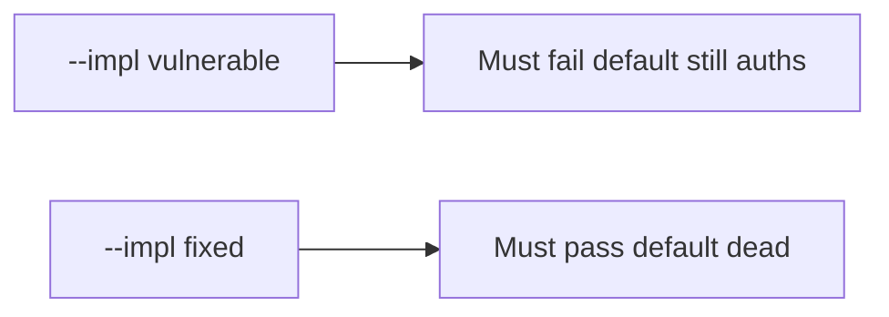

# 5.3-LO-05 — Evidence is default false after rotate, then a passing pair

**Kind:** verification-lab
**Loop step:** 5 Verify
**Standards:** OWASP ASVS 5.0.0 (final) `v5.0.0-13.2.3`.

## An invariant that cannot fail a test is still a slogan

“Secrets Manager is enabled” is not evidence. “The wiki says we rotated” is a mechanism observation. The oracle is: `auth("sk-lab-hardcoded", current="rotated-now") is False` and `auth("rotated-now", current=None) is False`. That observation must be **false** on `--impl vulnerable` (default still auths / missing current fails open) and **true** on `--impl fixed`.

## Mental model: vulnerable must fail: default still auths

The failing observation on `--impl vulnerable` is **default still auths**. A passing collection count is not this cell.



| Mode | Must show for this module |
|---|---|
| Normal | current secret authenticates (`test_current_secret_authenticates`; may pass on both) |
| Negative / abuse | hardcoded default false after rotate; missing current denies; vulnerable must fail |
| Not claimed | HSM; scheduled rotation; worker second default |

Lab tests in `labs/5.3/5.3-lab/tests/test_property.py`. `test_hardcoded_default_does_not_auth` is a **forbidden-outcome** test: a leftover default is not allowed to count as a passing control.

```text
python3 -m pytest labs/5.3/5.3-lab/tests --impl vulnerable
python3 -m pytest labs/5.3/5.3-lab/tests --impl fixed
```

The honest current-secret test may pass on both implementations. That does not excuse the default-dead and missing-current tests. If vulnerable does not fail `sk-lab-hardcoded`, the lab is miswired—fix the wiring, not the assertion.

## What the tests do not prove

- Envelope DEK/KEK
- `v5.0.0-13.3.3` / `v5.0.0-13.3.4` Level 3 advanced
- Mobile embedded keys (8.4)
- Worker second defaults (7.4)

Record those as residuals or later modules, not as silent passes.

## Practice

Execute both implementations this session. Write the fail/pass pair next to the matrix row. Reject a “test” that only greps `Vault` in a README without calling `auth("sk-lab-hardcoded", current="rotated-now")`.

## Transfer

Clinic gist. A test that only asserts HTTP 200 on login is not rotation evidence (see 9.3). A test that fetches a live gist is out of scope.

## Non-goals

Do not add a live gist search. Do not log the secret value. Keys stay out of this file.
