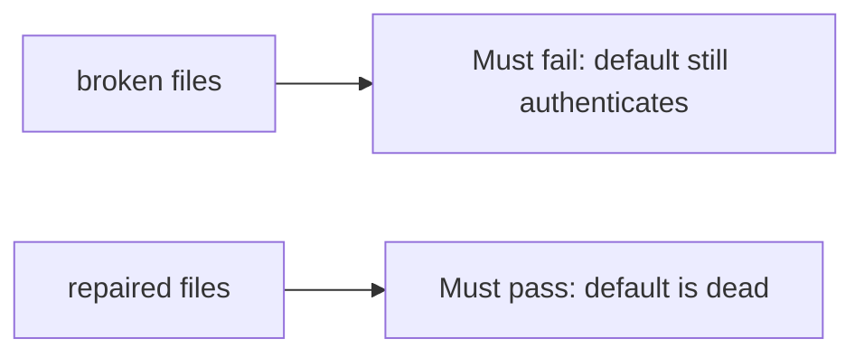

# A leftover default secret must fail

**Kind:** verification-lab
**Loop step:** 5 Verify

## Check it

Turning on Secrets Manager does not rotate the default. A wiki that says you rotated is a page. `auth("sk-lab-hardcoded", current="rotated-now")` has to be False, and `auth("rotated-now", current=None)` has to be False. The leftover files: the default still authenticates and a missing current still allows. Repair denies both leftover keys.

## Picture: leftover default must fail

A leftover default can still count as a valid key under a green suite.



| Mode | Must show for this topic |
|---|---|
| Normal | current secret authenticates (`test_current_secret_authenticates`; may pass on both) |
| Wrong input / abuse | hardcoded default false after rotate; missing current denies; broken files must fail |
| Not claimed | hardware box; timed rotation; worker second default |

In `labs/5.3/5.3-lab/tests/test_property.py`, leftover `DEFAULT` still authenticating is the fail `test_hardcoded_default_does_not_auth` names.

```text
python3 -m pytest labs/5.3/5.3-lab/tests --impl vulnerable
python3 -m pytest labs/5.3/5.3-lab/tests --impl fixed
```

The current secret may authenticate on both sides. You still have to kill the hardcoded default, and deny a missing current secret. If the broken files do not fail `sk-lab-hardcoded`, the lab is miswired — fix the wiring, not the check. A setup error is not proof the rule holds.

## What the tests do not prove

- Envelope wrapping (data key vs wrapping key)
- Hardware box / timed rotation (advanced extras)
- Keys baked into a phone app (later topic)
- A second default on a worker (later topic)

## Practice

Call `auth("sk-lab-hardcoded", current="rotated-now")`. A `Vault` mention in a README is the product, not the default dying.

## Use it somewhere new

HTTP 200 on login is not rotation evidence. Do not run a test that fetches a live gist.

## What this page is not doing

Do not add a live gist search. Do not log the secret value. Answer keys are not on this site.
