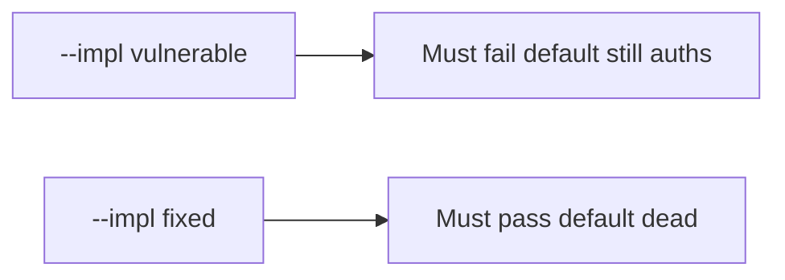

# 5.3-LO-05 — Evidence is default false after rotate, then a passing pair

**Kind:** verification-lab
**Loop step:** 5 Verify
**Standards:** OWASP ASVS 5.0.0 (final) `v5.0.0-13.2.3`.

## An invariant that cannot fail a test is still a slogan

“Secrets Manager is enabled” is not evidence. The oracle is the local pair.

## Mental model: fail-on-vulnerable, pass-on-fixed



| Case | Must show |
|---|---|
| Negative / abuse | hardcoded default false after rotate; missing current denies |
| Normal | current secret authenticates |
| Not claimed | HSM; scheduled rotation; worker second default |

```
python3 -m pytest labs/5.3/5.3-lab/tests --impl vulnerable
python3 -m pytest labs/5.3/5.3-lab/tests --impl fixed
```

The honest current-secret test may pass on both.

## What the tests do not prove

- Envelope DEK/KEK
- `v5.0.0-13.3.3` / `v5.0.0-13.3.4` Level 3 advanced
- Mobile embedded keys (8.4)

## Practice

Execute both implementations. Map each test to an LO-02 cell.

## Transfer

Clinic gist. A test that only asserts HTTP 200 on login is not rotation evidence.
