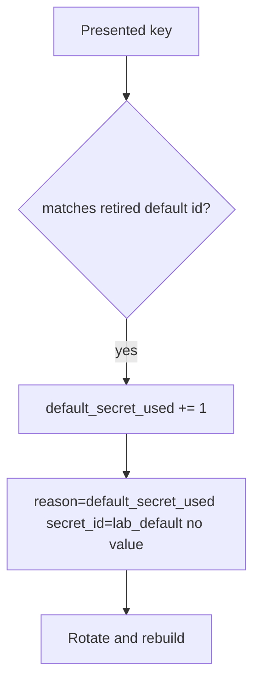

# 5.3-LO-06 — Detect default_secret_used; rotate without logging the secret

**Kind:** operations-exercise
**Loop step:** 6 Operate
**Standards:** NIST CSF 2.0 (final) DE/RS/RC as outcome labels; OWASP ASVS 5.0.0 (final) `v5.0.0-13.2.3`.

## Prevention is not absolute

An old image or a worker can still present `sk-lab-hardcoded`. Pair detect and recover. Do not log the secret (3.1).

## Mental model: alert on the default string id, not the value



| Outcome | This module |
|---|---|
| Detect | `default_secret_used`; secret scanning |
| Signal | secret id, request id; never the value |
| Recover | Rotate; rebuild images; purge logs |
| Residual | Copies already cloned |

## Practice

Write one log line you would accept. Tie it to `labs/5.3/5.3-lab`.

```
log_denied reason=default_secret_used secret_id=lab_default request_id=req_53sk
```

Reject any line that includes `sk-lab-hardcoded` or a real key.

## Transfer

Clinic: detect gist-key use; do not paste the key into the ticket.

## Non-goals

SIEM product names are not the property.
