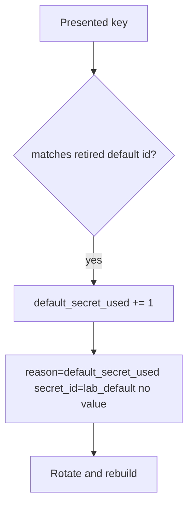

# 5.3-LO-06 — Detect default_secret_used; rotate without logging the secret

**Kind:** operations-exercise
**Loop step:** 6 Operate
**Standards:** NIST CSF 2.0 (final) DE/RS/RC as outcome labels; OWASP ASVS 5.0.0 (final) `v5.0.0-13.2.3`. CSF names outcomes; it does not kill `DEFAULT`.

## Prevention is not absolute

An old image or a worker can still present `sk-lab-hardcoded` after `auth` was “fixed once.” Pair detect and recover. Do not log the secret (3.1). Do not paste the key into the ticket.

## Mental model: alert on the default string id, not the value



| Outcome | This module |
|---|---|
| Detect | `default_secret_used`; secret scanning |
| Signal | secret id, request id; never the value |
| Recover | Rotate; rebuild images; purge logs |
| Residual | Copies already cloned |

CSF 2.0 Detect / Respond / Recover name outcomes. They do not prove `v5.0.0-13.2.3`. A SIEM product name is not the property. Re-run `test_hardcoded_default_does_not_auth` after any `auth` change; a green “Vault enabled” tile is not that pytest. Images and workers are other copies of the same cell — inventory them before claiming Recover.

Recovery is incomplete if the next image still ships `DEFAULT = "sk-lab-hardcoded"` as an or-clause. Rebuild and prove `test_missing_current_denies` the same day you rotate, or the next fail-open still authenticates the gist copy. A vault tile is not that pytest.

## Framework defaults versus the operate guarantee

A vault dashboard will show “rotation enabled” and stay silent when `DEFAULT` is still an or-clause. Detection must observe **presented equals the retired secret id**, not a product tile. If the alert includes `sk-lab-hardcoded` or a real key, you have opened a 3.1 cell.

## Practice

Write one log line you would accept. Tie it to `labs/5.3/5.3-lab`.

```text
log_denied reason=default_secret_used secret_id=lab_default request_id=req_53sk
```

Reject any line that includes `sk-lab-hardcoded`, a real key, or “Vault handled.”

## Transfer

Clinic: detect gist-key use; do not paste the key into the ticket. Do not fetch a live gist.

## Non-goals

SIEM product names are not the property. Live gist searches are out of scope. Gates 0–10 stay not-attempted.
