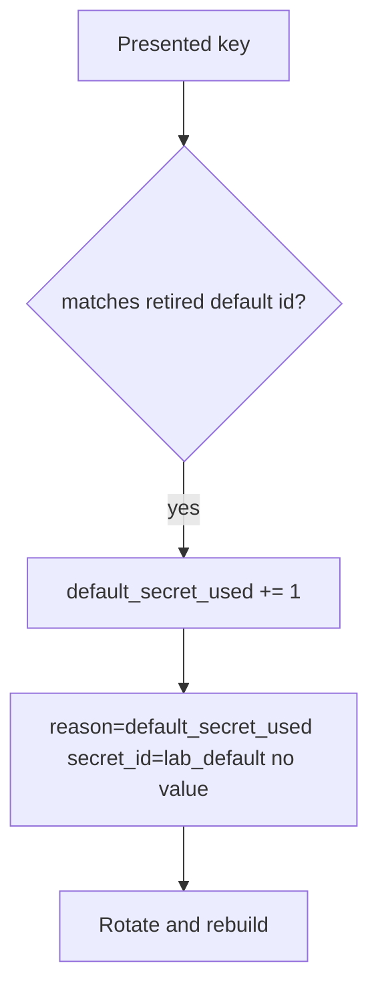

# Notice default_secret_used; rotate without logging the secret

**Kind:** operations-exercise
**Loop step:** 6 Operate

## Stopping it is not enough

An old image or a worker can still present `sk-lab-hardcoded` after `auth` was “fixed once.” Pair notice and recover. Do not log the secret. Do not paste the key into the ticket.

## Picture: alert on the default string id, not the value



| Outcome | This topic |
|---|---|
| Notice | `default_secret_used`; secret scanning |
| What the line holds | secret id, request id; never the value |
| Recover | Rotate; rebuild images; purge logs |
| Leftover | Copies already cloned |

Industry lists name detect, respond, recover. They do not kill `DEFAULT`. A log-product name is not the rule. Re-run `test_hardcoded_default_does_not_auth` after any `auth` change; a green “Vault enabled” tile is not that pytest. Images and workers are other copies of the same cell — inventory them before claiming recover.

Recovery is incomplete if the next image still ships `DEFAULT = "sk-lab-hardcoded"` as an or-clause. Rebuild and prove `test_missing_current_denies` the same day you rotate, or the next allow-when-missing still authenticates the gist copy. A vault tile is not that pytest.

## What the framework does vs what you still have to check

A vault dashboard will show “rotation enabled” and stay silent when `DEFAULT` is still an or-clause. Notice must observe **presented equals the retired secret id**, not a product tile. If the alert includes `sk-lab-hardcoded` or a real key, you have opened a leak.

## Practice

Write one log line you would accept. Tie it to `labs/5.3/5.3-lab`.

```text
log_denied reason=default_secret_used secret_id=lab_default request_id=req_53sk
```

Reject any line that includes `sk-lab-hardcoded`, a real key, or “Vault handled.”

## Use it somewhere new

Clinic: notice gist-key use; do not paste the key into the ticket. Do not fetch a live gist.

## What this page is not doing

A log-product name is not the rule. Live gist searches are out of scope. Course gates stay unclaimed.
