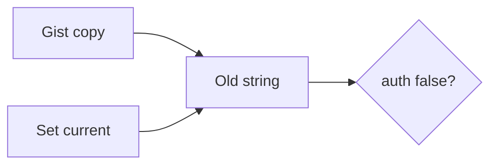

# 5.3-LO-07 — Transfer: gist-leaked clinic API key

**Kind:** transfer-challenge
**Loop step:** 7 Transfer
**Standards:** OWASP ASVS 5.0.0 (final) `v5.0.0-13.2.3` and `v5.0.0-13.3.1`.

## Change the workplace; keep old-value-must-die

Do not answer with a Top 10 / CWE / scanner as the definition of security. The SecureCollab sentence was: `auth("sk-lab-hardcoded", current="rotated-now")` is false. Rewrite it for a clinic without changing the fork.

**Prompt:** Clinic lab API key in a gist. Also sketch envelope DEK vs KEK on compromise.

**Product sketch:** EHR-lite with a backend integration key.

Rewrite the SecureCollab sentence. Include:

1. attacker capabilities (gist reader; old container — not a live clinic);
2. trust assumptions (which current secret is TCB; the vault brand is not);
3. forbidden outcome (`auth` true for the leaked string after rotate, not “HIPAA”);
4. a test idea on a **local** fixture only (leaked string false; missing current denies);
5. residual (images; logs; worker default; HSM Level 3);
6. WCAG only if a human rotation acknowledgement is in the claim.

## Mental model: leak, rotate, prove dead

If rotate only updates the wiki, the gist string still auths. FastAPI Settings, a vault brand, and `.gitignore` do not pop `DEFAULT`. Envelope DEK vs KEK is a later sketch: compromising the KEK still requires the old DEK to be dead — same fork, different wrapping.

The clinic rewrite still has to keep the SecureCollab fork: the leaked string is false after rotate, and missing current denies. Moving the key to Vault while leaving `or presented == DEFAULT` in `auth` leaves the gist live. The local pytest analogue is `test_hardcoded_default_does_not_auth` plus `test_missing_current_denies` — on a fixture, not a live gist.

## What graders reject

| Reject | Why |
|---|---|
| “We use Vault” without a test | Sticker |
| Live gist search | Lab policy |
| gitignore as revocation | Artifact still live |
| HTTP 200 as rotation evidence | Wrong observation |
| Password rotation as this cell | Different authenticator (4.2) |

## Practice

One page. No keys. `labs/5.3/5.3-lab` is the only running system you may break. Do not fetch a live gist or paste a key into a ticket.

## Non-goals

Live-target key hunts. Real API keys. Claiming Gate 5 from this page.
