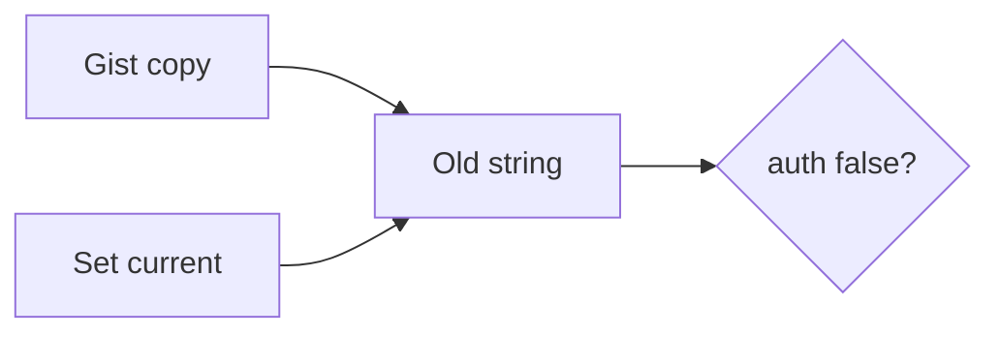

# Same idea: a gist-leaked clinic API key

**Kind:** transfer-challenge
**Loop step:** 7 Transfer

## Use it somewhere new

The notes-app scaffolding goes away. You get a **clinic lab API key in a gist**. Do not answer with an awareness-list name, a CWE, or a scanner as the definition of security. The notes-app sentence was: `auth("sk-lab-hardcoded", current="rotated-now")` is false. Rewrite it for a clinic without changing the fork.

**Prompt:** Clinic lab API key in a gist. Also sketch envelope wrapping (data key vs wrapping key) on compromise.

**Product sketch:** EHR-lite with a backend integration key.

Rewrite the notes-app sentence. Include:

1. who can act (gist reader; old container — **not** a live clinic);
2. what you trust (which current secret is trusted; the vault brand is not);
3. what must not happen (`auth` true for the leaked string after rotate — not a privacy-law name);
4. a test idea on a **local** practice only (leaked string false; missing current denies);
5. leftover (images; logs; worker default; hardware box as an advanced extra);
6. whether a human rotation acknowledgement must meet the web accessibility baseline — only if a human acknowledgement is in the claim.

## Picture: leak, rotate, prove dead

If rotate only updates the wiki, the gist string still authenticates. A settings library, a vault brand, and `.gitignore` do not pop `DEFAULT`. Envelope wrapping is a later sketch: compromising the wrapping key still requires the old data key to be dead — same fork, different wrapping.

The clinic rewrite still has to keep the notes-app fork: the leaked string is false after rotate, and missing current denies. Moving the key to Vault while leaving `or presented == DEFAULT` in `auth` leaves the gist live. The local pytest analogue is `test_hardcoded_default_does_not_auth` plus `test_missing_current_denies` — on a practice, not a live gist.

## What is not good enough

| Reject | Why |
|---|---|
| “We use Vault” without a test | Sticker |
| Live gist search | Course rules |
| gitignore as revocation | Artifact still live |
| HTTP 200 as rotation evidence | Wrong observation |
| Password rotation as this cell | Different authenticator |

## Practice

One page. No keys. `labs/5.3/5.3-lab` is the only running system you may break. Do not fetch a live gist or paste a key into a ticket.

## Can people still use it

If a human rotation acknowledgement is in the claim, that step must be something keyboard and assistive tech can use, not only a mouse click. A usable acknowledgement is not the rotation check.

## What this page is not doing

Live-target key hunts. Real API keys. Claiming a course gate from this page.
