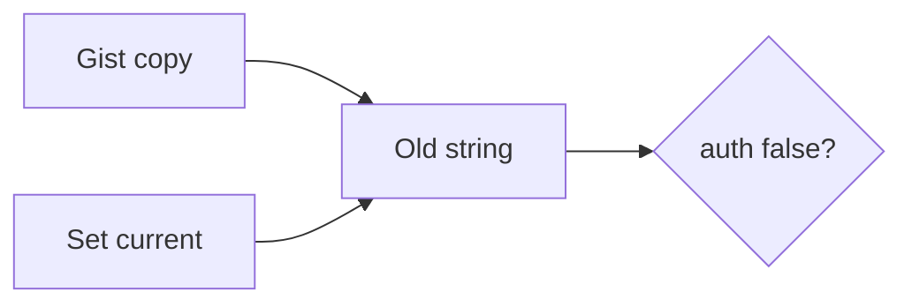

# 5.3-LO-07 — Transfer: gist-leaked clinic API key

**Kind:** transfer-challenge
**Loop step:** 7 Transfer
**Standards:** OWASP ASVS 5.0.0 (final) `v5.0.0-13.2.3` and `v5.0.0-13.3.1`.

## Change the workplace; keep old-value-must-die

Do not answer with a Top 10 / CWE / scanner as the definition of security.

**Prompt:** Clinic lab API key in a gist. Also sketch envelope DEK vs KEK on compromise.

**Product sketch:** EHR-lite with a backend integration key.

Rewrite the SecureCollab sentence. Include:

1. attacker capabilities (gist reader; old container — not a live clinic);
2. trust assumptions (which current secret is TCB; the vault brand is not);
3. forbidden outcome (`auth` true for the leaked string after rotate, not “HIPAA”);
4. a test idea on a **local** fixture only;
5. residual (images; logs; worker default; HSM Level 3);
6. WCAG only if a human rotation acknowledgement is in the claim.

## Mental model: leak, rotate, prove dead

## What graders reject

| Reject | Why |
|---|---|
| “We use Vault” without a test | Sticker |
| Live gist search | Lab policy |
| gitignore as revocation | Artifact still live |

## Practice

One page. No keys. `labs/5.3/5.3-lab` is the only running system you may break.
