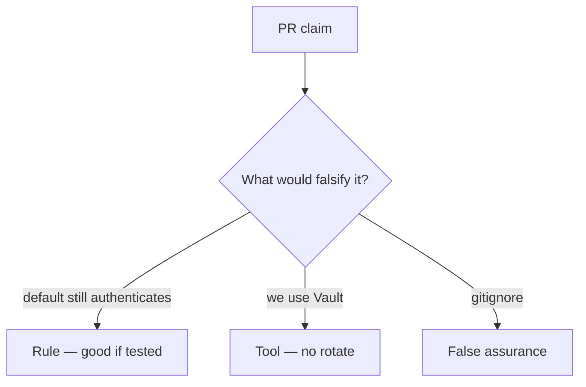

# Review of leftover defaults

**Kind:** code-review
**Loop step:** Review

## What you are reviewing

Review `labs/5.3/5.3-lab/vulnerable/` as a change to notes-app secret rotation. Check whether `auth("sk-lab-hardcoded", current="rotated-now")` is still true.

`test_hardcoded_default_does_not_auth` is the check. “Will rotate later” is a postponement.

## Picture: DEFAULT still accepted

**`DEFAULT = 'sk-lab-hardcoded'` still accepted**.

The default still has to be dead after rotate, and a missing current still has to deny. Rotate without killing `DEFAULT` and the old secret still authenticates. A vault import without killing `DEFAULT` is still the same problem.

## Problems to find (name them yourself)

- `DEFAULT = 'sk-lab-hardcoded'` still accepted
- Secret in README “for convenience”
- No rotation test
- Same key for all tenants

Also reject: real production keys in practice files; closing findings without re-running `test_hardcoded_default_does_not_auth`; keys in learner notes; allow when current is missing.

## Common mix-ups

- gitignore means it was never leaked
- A key service equals rotated
- Passwords and API keys are the same lifecycle
- Vault brand is the rule
- Missing current should allow

## Use it somewhere new

Moving the key to Vault without killing the default still leaves the old secret live. What still has to be dead so `sk-lab-hardcoded` cannot authenticate after a Vault move?

## What this page is not doing

Shipping a hardcoded default plus “will rotate later” leaves the old secret live with nobody assigned. Do not fetch a live gist to prove the finding.
