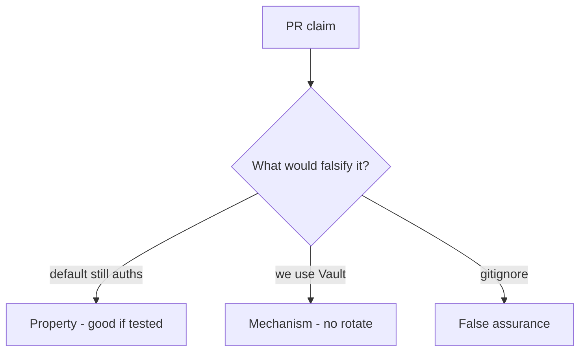

# 5.3-LO-08 — Review leftover defaults as a PR, not a vault ticket

**Kind:** code-review
**Loop step:** Review
**Standards:** OWASP ASVS 5.0.0 (final) `v5.0.0-13.2.3`.

## Review the fixture as if it were SecureCollab rotation

Review `labs/5.3/5.3-lab/vulnerable/` as a SecureCollab PR. Intended findings live only in `content/assessment/keys/5.3.md` — not here.

## Mental model: property, mechanism, or false assurance

Seeded smells (label them yourself; do not open the keys file):

- `DEFAULT = 'sk-lab-hardcoded'` still accepted
- Secret in README “for convenience”
- No rotation test
- Same key for all tenants

Also reject: real production keys in fixtures, keys in lessons.

## Misconceptions

- gitignore means it was never leaked
- KMS equals rotated
- Passwords and API keys are the same lifecycle

## Practice

Write three review notes. Tie at least one to `test_hardcoded_default_does_not_auth`.

## Transfer

Clinic PR that “moved the key to Vault” without killing the default is incomplete.
