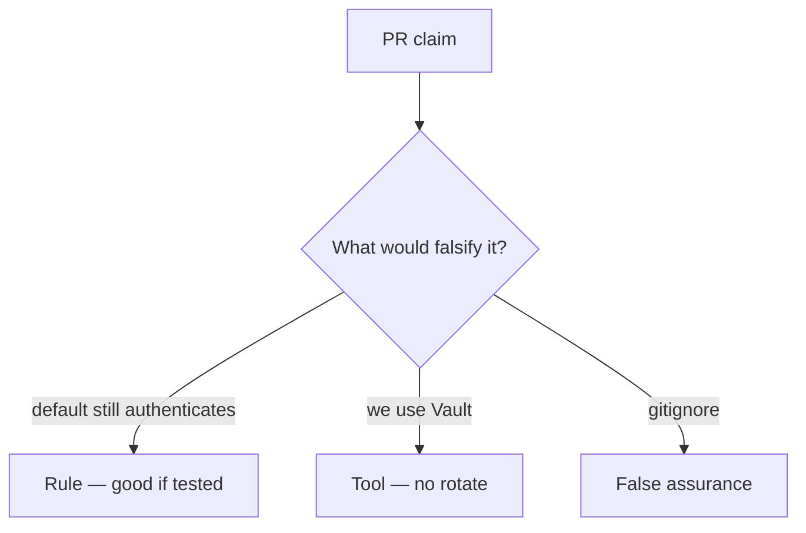

# Review of leftover defaults

**Kind:** code-review
**Loop step:** Review

## What you are reviewing

Review `labs/5.3/5.3-lab/vulnerable/` as a change to notes-app secret rotation. Check whether `auth("sk-lab-hardcoded", current="rotated-now")` is still true.

You already ran `test_hardcoded_default_does_not_auth` — that is the rule. A comment “will rotate later” is not.

## Picture: DEFAULT still accepted

**`DEFAULT = 'sk-lab-hardcoded'` still accepted**.

The default still has to be dead after rotate, and a missing current still has to deny. If the change never checks equality with current, that leftover path is still open. A vault import without killing `DEFAULT` is still the same problem.

## Problems to find (name them yourself)

- `DEFAULT = 'sk-lab-hardcoded'` still accepted
- Secret in README “for convenience”
- No rotation test
- Same key for all tenants

Also reject: real production keys in practice files; closing findings without re-running `test_hardcoded_default_does_not_auth`; keys in learner notes; allow when current is missing.

## Common mix-ups

- gitignore means it was never leaked
- A key service equals rotated
- Passwords and API keys are the same lifecycle
- Vault brand is the rule
- Missing current should allow

## Practice

Write the review that would block this change. Name `test_hardcoded_default_does_not_auth`.

## Use it somewhere new

Clinic change that “moved the key to Vault” without killing the default is an incomplete review. Name the independent falsehood that would still keep `sk-lab-hardcoded` from authenticating.

## What this page is not doing

Do not merge by adding a comment “will rotate later.” That comment is leftover risk without an owner. Do not fetch a live gist to prove the finding.
