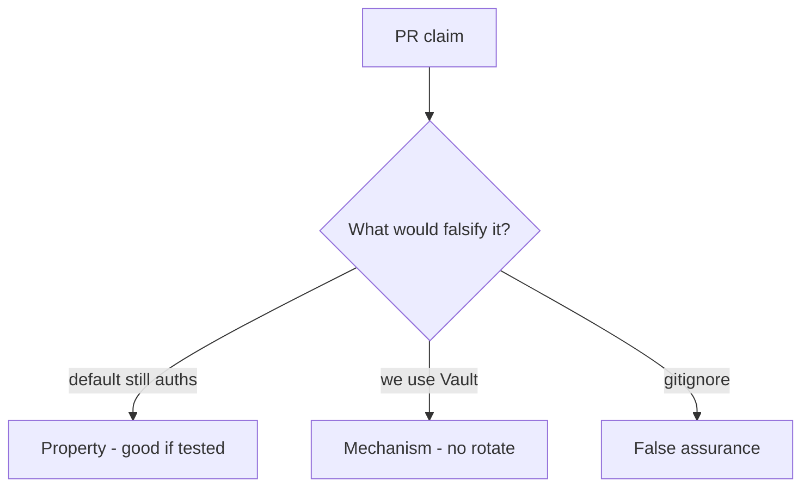

# 5.3-LO-08 — Review leftover defaults as a PR, not a vault ticket

**Kind:** code-review
**Loop step:** Review
**Standards:** OWASP ASVS 5.0.0 (final) `v5.0.0-13.2.3`.

## Review the fixture as if it were SecureCollab rotation

Review `labs/5.3/5.3-lab/vulnerable/` as a SecureCollab PR. Your job is not to count suspicious lines. Reconstruct whether `auth("sk-lab-hardcoded", current="rotated-now")` is still true, compare that with the module invariant, and write changes a developer can verify.

Intended findings live only in `content/assessment/keys/5.3.md` — not here. Do not open the keys file until your review has been evaluated.

## Mental model: DEFAULT = 'sk-lab-hardcoded' still accepted

Start with this seeded smell: **`DEFAULT = 'sk-lab-hardcoded'` still accepted**. Label it property, mechanism, or false assurance before you accept the PR.

Classification starts at the protected effect (default dead after rotate; missing current denies). Everything that is not equality with current at that call is a candidate leftover path. A vault import without killing `DEFAULT` is the same smell, not a different finding class.

## Seeded smells (label them yourself)

- `DEFAULT = 'sk-lab-hardcoded'` still accepted
- Secret in README “for convenience”
- No rotation test
- Same key for all tenants

Also reject: real production keys in fixtures; closing findings without re-running `test_hardcoded_default_does_not_auth`; keys in lessons; fail-open when current is missing.

## Misconceptions this module refuses

- gitignore means it was never leaked
- KMS equals rotated
- Passwords and API keys are the same lifecycle
- Vault brand is the property
- Missing current should fail open

## Practice

Write three review notes a maintainer could act on. Each note: observation, property or false assurance, suggested structural change, residual you will **not** delete. Tie at least one to `test_hardcoded_default_does_not_auth`.

## Transfer

Clinic PR that “moved the key to Vault” without killing the default is an incomplete mediation review. Name the independent falsehood that would still keep `sk-lab-hardcoded` from authenticating.

## Non-goals

Do not merge by adding a comment “will rotate later.” That comment is a residual without an owner. Do not fetch a live gist to prove the finding.
