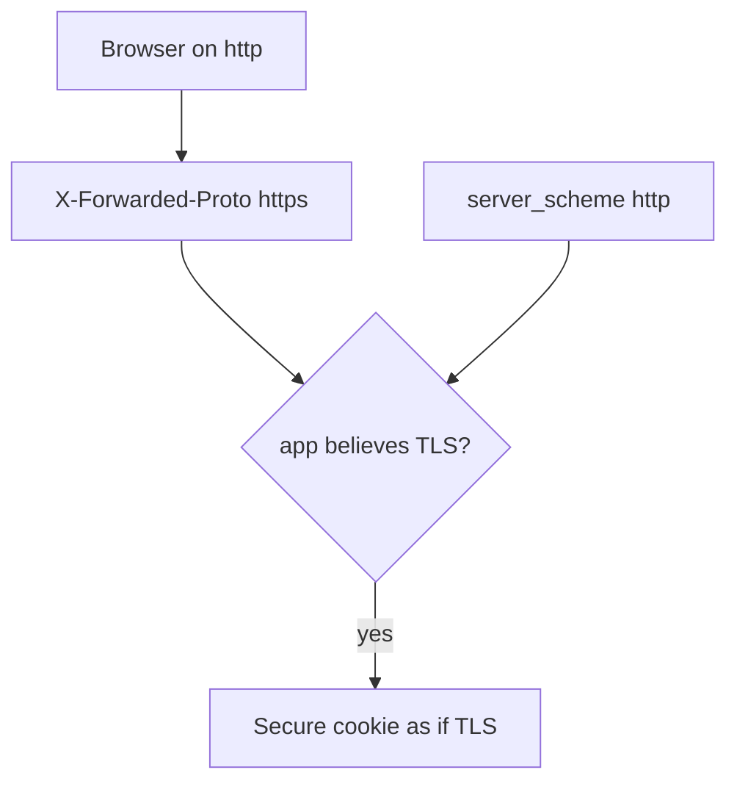
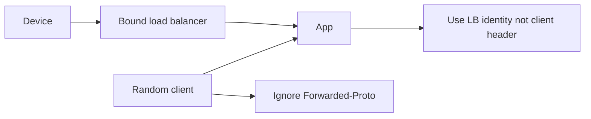

# A client Forwarded-Proto header is not TLS

**Kind:** concept-model
**Loop step:** 1 Property

## The rule

The notes app must know whether the **server socket** negotiated TLS. A browser can send `X-Forwarded-Proto: https` on cleartext. That header is a client claim. An earlier topic already taught hop versus cache key; the rule here is channel authenticity for cookies, HSTS, and redirects.

> `channel_is_https({"X-Forwarded-Proto": "https"}, "http")` must be false. `channel_is_https({}, "https")` may be true. A trusted proxy is a **bound peer**, not a header name. This practice has no trusted proxy.

What must not happen is **a client-supplied Forwarded-Proto counted as TLS**. Cookies marked Secure and HSTS fire while the user stays on cleartext. That is an authenticity failure of the transport.

TLS has to be on the public HTTP service with no cleartext fallback. A current TLS version (TLS 1.3 is the current handshake). Clients still have to check certificates — that is a different rule. OCSP stapling and encrypted client hello are advanced extras, not this check. A server flag that trusts proxy headers is not the hop-proof check.

## Picture: hop vs claim



Picture a client on cleartext who wants the app to think TLS is on. Trusting any `X-Forwarded-*` from the socket peer is not what you trust unless that peer is a locked load balancer you bound.

“Force HTTPS” in a dashboard, HSTS preload, and certificate pinning do not stop a client `X-Forwarded-Proto` from counting as TLS.

## Picture: a trusted proxy is identity, not a header



Pinning on a phone (later) is leftover: operational breakage versus extra binding. Do not mandate it here.

## Why it happens, what it costs, how you stop it, how you notice, how you recover

| Slice | For this rule |
|---|---|
| Why it happens | The app believes the client about the channel |
| What's already wrong | Header https + socket http counts as true |
| Trigger | Cleartext client sets Forwarded-Proto |
| What it costs | Authenticity of the transport; cookies and HSTS lie |
| How you stop it | Ignore client proto unless the immediate peer is a bound proxy |
| How you notice | `header_https_socket_http` |
| How you recover | HSTS once TLS is real; revoke cookies issued over cleartext |

## What the framework does vs what you still have to check

A server flag that trusts proxy headers, with no trusted-proxy IP, is this bug. A browser `https://` in the page’s API client is not the API socket. Files in `labs/5.4/5.4-lab`. No live load balancer.

## What the tool cannot do

- Correct TLS to the load balancer is not end-to-end if you needed end-to-end messaging.
- Cleartext inside the network is a named leftover.
- Pinning versus breakage — write it down; do not mandate it.

## Practice

Draw hops: device — ? — load balancer — app. Who may assert proto? Then run:

```text
python3 -m pytest labs/5.4/5.4-lab/tests --impl vulnerable
python3 -m pytest labs/5.4/5.4-lab/tests --impl fixed
```

## Use it somewhere new

The page uses `https://` while the API socket is `http`. Mutual TLS names a service identity; that is not this header.

## What this page is not doing

Do not use live TLS attacks, strip-attack walkthroughs, pinning exploits. This site does not mark you as finished. Answer keys are not on this site.
