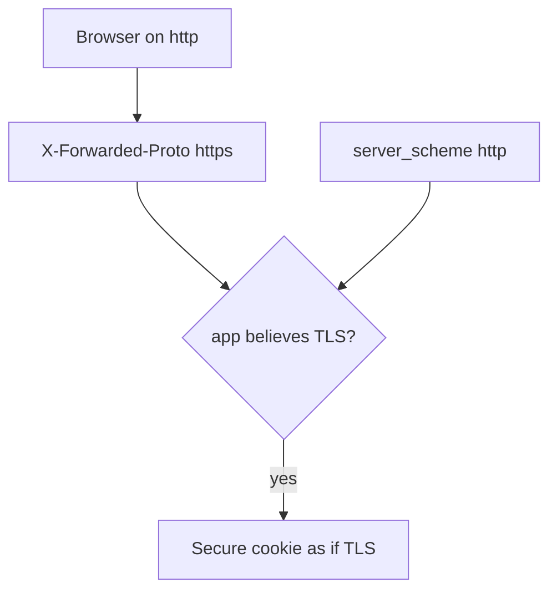
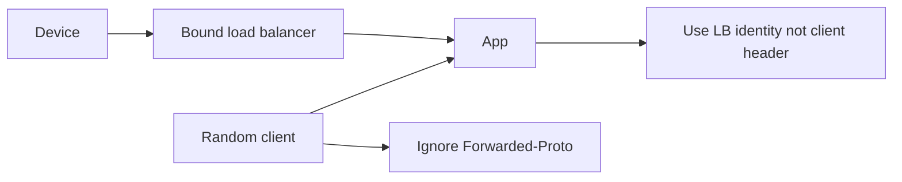

# 5.4-LO-01 — A client Forwarded-Proto header is not TLS

**Kind:** concept-model
**Loop step:** 1 Property
**Standards:** IETF RFC 9846 TLS 1.3 (final); OWASP ASVS 5.0.0 (final) `v5.0.0-12.2.1`, `v5.0.0-12.1.1`, `v5.0.0-12.3.2`; `v5.0.0-12.1.4` and `v5.0.0-12.1.5` are **Level 3, advanced**. MASVS-NETWORK waits for 8.x. Pinning is a trade-off, not a universal rule. uvicorn `--proxy-headers` is not this sentence.

## The claim this module owns

SecureCollab Phase 1 must know whether the **server socket** negotiated TLS. A browser can send `X-Forwarded-Proto: https` on cleartext. That header is a client claim. Module 2.2 already taught hop vs cache key; this module’s cell is channel authenticity for cookies, HSTS, and redirects.

> `channel_is_https({"X-Forwarded-Proto": "https"}, "http")` must be false. `channel_is_https({}, "https")` may be true. A trusted proxy is a **bound peer**, not a header name. This lab has no trusted proxy.

The forbidden outcome is **client-supplied Forwarded-Proto counted as TLS**. That is a 1.1 authenticity failure of the transport: Secure cookies and HSTS fire while the user stays on cleartext.

ASVS `v5.0.0-12.2.1` wants TLS for external HTTP without fallback. `v5.0.0-12.1.1` wants TLS 1.2/1.3. `v5.0.0-12.3.2` wants clients to validate certificates. `v5.0.0-12.1.4` (OCSP stapling) and `v5.0.0-12.1.5` (ECH) are **Level 3 (advanced)**. RFC 9846 is current TLS 1.3 (obsoletes RFC 8446).

## Mental model: hop vs claim



The attacker is a client on cleartext who wants the app to think TLS is on. Trusting any `X-Forwarded-*` from the socket peer is not a TCB unless that peer is a locked load balancer you bound.

**Mechanism (not the property):** “Force HTTPS” in a dashboard, HSTS preload, or certificate pinning.

## Mental model: trusted proxy is identity, not a header



Pinning on mobile (8.x) is a residual trade-off: operational breakage vs extra binding. Do not mandate it here.

## Root cause vs impact vs prevention vs detection vs recovery

| Slice | For this property |
|---|---|
| Root cause | Confused deputy: app believes client about the channel |
| Preconditions | Header https + socket http => True |
| Trigger | Cleartext client sets Forwarded-Proto |
| Impact | Authenticity of transport; cookies/HSTS lie |
| Prevention | Ignore client proto unless the immediate peer is a bound proxy |
| Detection | `header_https_socket_http` |
| Recovery | HSTS once TLS is real; revoke cookies issued over cleartext |

## Framework defaults versus the channel guarantee

uvicorn `--proxy-headers` without a trusted proxy IP is this bug. SPA `https://` in axios is not the API socket. Oracle: `labs/5.4/5.4-lab`. No live LB.

## Mechanism limits

- Correct TLS to the LB is not end-to-end if you needed e2e messaging.
- Internal HTTP (`v5.0.0-12.3.3`) is a named hole.
- Pinning vs breakage — document, don’t mandate.

## Practice

Draw hops: device — ? — LB — app. Who may assert proto? Then run:

```
python3 -m pytest labs/5.4/5.4-lab/tests --impl vulnerable
python3 -m pytest labs/5.4/5.4-lab/tests --impl fixed
```

The first command must fail. The second must pass.

## Transfer

Clinic: SPA uses `https://` while the API socket is `http`. mTLS service identity vs this header.

## Non-goals

Live TLS attacks, SSLStrip walkthroughs, pinning exploits. Gates 0–10 and milestones M0–M5 stay **not-attempted**. Answer keys are not in this file.
