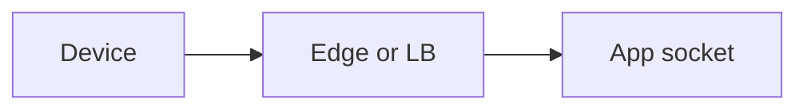
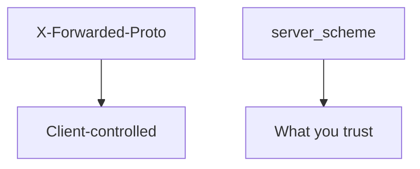

# A hop map someone else can test

**Kind:** design-exercise
**Loop step:** 2 Model

## Could someone else name the checks?

Until you have **each hop and who is allowed to assert the scheme**, “We enabled HTTPS” is still a slogan.

`channel_is_https(headers, server_scheme)` — no live load balancer.

> `channel_is_https({"X-Forwarded-Proto": "https"}, "http")` must be false. If a hop is missing from the map, a client header can still count as TLS.

## Picture: three hops

Only a **bound** edge may forward proto. This practice has none, so `server_scheme` is the only input.

## Picture: the header is untrusted data

An earlier topic used hop versus cache key. Here the hop is the channel-authenticity rule.

## Step 1: name the pieces

| Piece | This system |
|---|---|
| Who | cleartext client; app |
| What | channel scheme |
| Actions | `channel_is_https` |
| Paths | socket; optional Forwarded header |
| What you trust | `server_scheme` in this practice |
| What you do not trust | `X-Forwarded-Proto` from anyone |
| Time | cookie flags decided now |
| The rule | Authenticity of the transport |

## Step 2: write allow and deny

| Who | What | Action | Decision |
|---|---|---|---|
| socket https | channel | treat as TLS | allow |
| socket http | channel | treat as TLS | deny |
| client header https + socket http | channel | treat as TLS | deny |
| bound load balancer (named leftover) | proto | assert | not in this practice |

A missing “header https × socket http × deny” row is how the client header still counts as TLS. Write the hole.

## Practice

Label hops on `channel.py` under `labs/5.4/5.4-lab`. Name who may assert proto and the case that would prove the deny false. Fake data only.

## Use it somewhere new

Mutual TLS as service identity. A page’s API client `https://` is not the API socket.

## What can still go wrong

TLS to the load balancer is not end-to-end. Pinning is leftover. OCSP stapling and encrypted client hello are advanced extras.

## What this page is not doing

Do not run this map against a public clinic or a live load balancer. Answer keys are not on this site.
