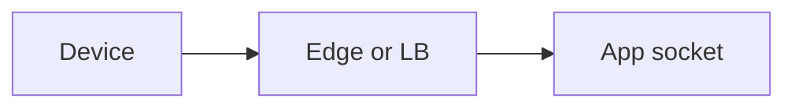
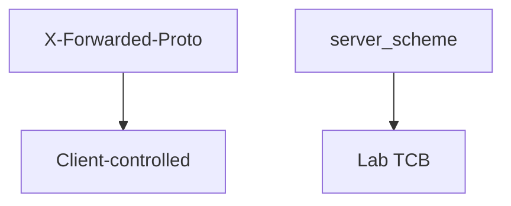

# 5.4-LO-02 — A hop map a second engineer can test

**Kind:** design-exercise
**Loop step:** 2 Model
**Standards:** RFC 9846 (final); OWASP ASVS 5.0.0 (final) `v5.0.0-12.2.1`.

## Can a second engineer name pytest cases from your hop map?

“We enabled HTTPS” is not this lesson. A reviewable model names **each hop and who is allowed to assert the scheme**.

SecureCollab Phase 1 freeze: local `channel_is_https(headers, server_scheme)`. No live LB.

## Mental model: three hops

Only a **bound** edge may forward proto. This lab has none, so `server_scheme` is the only input.

## Mental model: header is untrusted data

Module 2.2 used hop vs cache key. Here the hop is the channel authenticity cell.

## Step 1: freeze pieces

| Piece | This system |
|---|---|
| Subjects | cleartext client; app |
| Objects | channel scheme |
| Actions | `channel_is_https` |
| Channels | socket; optional Forwarded header |
| TCB | server_scheme in this lab |
| Untrusted | X-Forwarded-Proto from anyone |
| State / time | cookie flags decided now |
| 1.1 cell | Authenticity of transport |

## Step 2: write cells

| Subject | Object | Action | Decision |
|---|---|---|---|
| socket https | channel | treat as TLS | allow |
| socket http | channel | treat as TLS | deny |
| client header https + socket http | channel | treat as TLS | deny |
| bound LB (named residual) | proto | assert | not in this fixture |

## Practice

Draw the hops. Point at `labs/5.4/5.4-lab` file `channel.py`.

## Transfer

mTLS service identity. SPA axios baseURL.

## Residual risk

TLS-to-LB not e2e; pinning trade-off; OCSP/ECH Level 3.

## Non-goals

Top 10 as the definition of security. Keys stay out of lessons.
