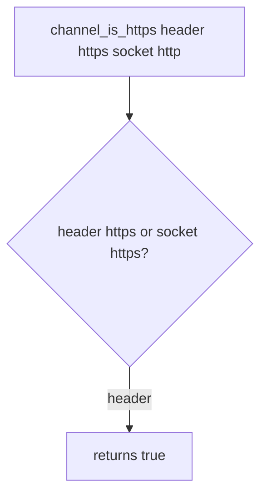

# 5.4-LO-03 — Observe the believed header, do not trophy a strip attack

**Kind:** mechanism-lab
**Loop step:** 3 Break
**Standards:** OWASP ASVS 5.0.0 (final) `v5.0.0-12.2.1`.

## Authorized scope

`labs/5.4/5.4-lab` only. Synthetic headers. No live networks.

**Forbidden outcome:** Client-supplied `X-Forwarded-Proto: https` on an `http` socket counts as TLS.

## Mental model: header OR socket



The vulnerable tree demonstrates **cause** (confused deputy), not an SSLStrip walkthrough.

## What to read in the fixture

`vulnerable/channel.py` returns true if the header is `https` **or** the socket is `https`. Tests require the mismatch false, plain http false, and socket https true.

## Root cause vs impact

| Slice | Lab |
|---|---|
| Root cause | App believes client about the channel |
| Impact | Cookies/HSTS as if TLS on cleartext |
| Not the lesson | A CDN product name as the definition |

## Practice

```
python3 -m pytest labs/5.4/5.4-lab/tests --impl vulnerable
```

Record `test_client_forwarded_proto_is_not_tls`. Do not probe public hosts.

## Transfer

Clinic SPA. Predict without leaving this directory.

## Non-goals

No live-target instructions. Synthetic data only.
