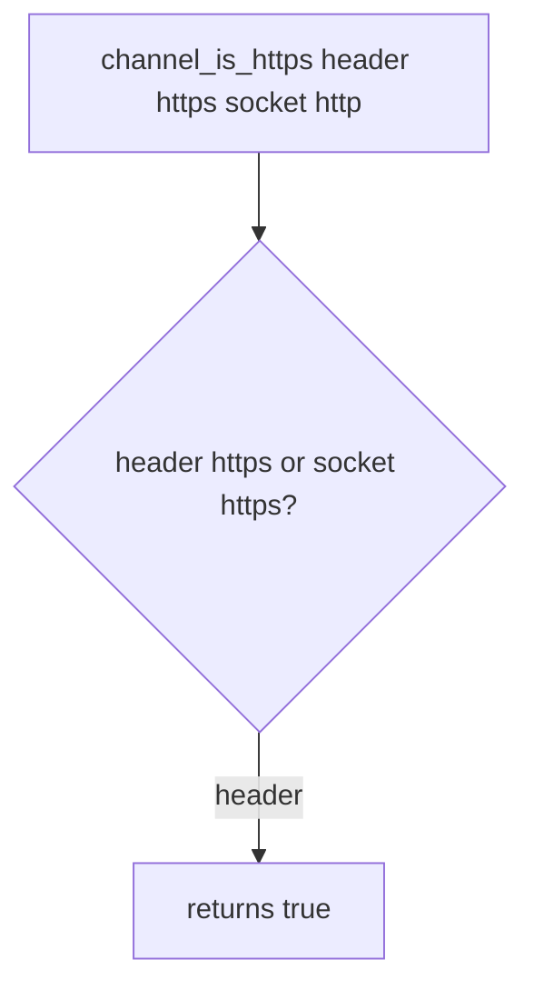

# Practice: a client header counted as TLS

**Kind:** mechanism-lab
**Loop step:** 3 Break

## Try it

The practice is not a website you attack. `channel_is_https` uses fake headers and a `server_scheme` string. It does not open a socket or a CDN. A client `X-Forwarded-Proto: https` on an `http` socket still counting as TLS is the break; you do not need a strip attack.

> A client Forwarded-Proto header is not TLS. `channel_is_https({"X-Forwarded-Proto": "https"}, "http")` must be false.

## Where you may practice

Stay inside `labs/5.4/5.4-lab`. Restore the broken and repaired folders when you are done. Fake headers only.

Do not probe a public host. Do not probe an employer load balancer. Do not probe a classmate preview.

What must not happen: client-supplied `X-Forwarded-Proto: https` on an `http` socket counts as TLS. `channel_is_https({"X-Forwarded-Proto": "https"}, "http")` returns true.

Picture a **cleartext client who can set `X-Forwarded-Proto`** — a clinic page whose API client uses `https://` while the API socket is `http`, or a dashboard “Force HTTPS” toggle that trusts the header. `channel_is_https` binds the **server socket**, not a client claim — not A server flag that trusts proxy headers, a CDN product name, or HSTS preload.

## Picture: header OR socket



The app believes the client about the channel — not a strip-attack walkthrough. `channel_is_https` returns true if the header is `https` **or** the socket is `https`. You do not need a live man-in-the-middle. You must not run one.

TLS has to be on the public HTTP service with no cleartext fallback. A client header is not that TLS.

## What to look at: the cause, not a hunt

`vulnerable/channel.py` returns true if the header is `https` **or** the socket is `https`. Checks:

- `test_client_forwarded_proto_is_not_tls`
- `test_plain_http_is_not_https`
- `test_server_https_counts` — honest socket-https path; may pass on both


| What you see | What kind of failure | Not the lesson |
|---|---|---|
| Header https, socket http, helper true | The app believes the client about the channel | “HTTPS is on” |
| True if header **or** socket is https | Client claim counted as TLS | A CDN product name |
| No check of `server_scheme` alone | Socket is not the scheme | “Force HTTPS is checked” |

## Why it happens, what it costs, how you stop it, how you notice, how you recover

| Slice | This practice |
|---|---|
| The rule | Client Forwarded-Proto does not make the channel TLS |
| Why it happens | The app believes the client about the channel |
| What's already wrong | Header `https` OR socket `https` returns true |
| Trigger | `channel_is_https({"X-Forwarded-Proto": "https"}, "http")` |
| What it costs | Cookies and HSTS fire as if TLS while the hop is cleartext |
| How you stop it | Bind scheme to `server_scheme == "https"` only; bound proxy identity later |
| How you notice | `header_https_socket_http` |
| How you recover | Stop trusting the header; revoke cookies issued on that path |
| Not the lesson | A CDN product name, HSTS preload, or a live strip |

## What the framework does vs what you still have to check

A server flag that trusts proxy headers, with a wildcard trusted hop, will believe whoever sent the header. The request URL scheme after that middleware is not the socket. Headers the page reads in the browser are not TLS. Header https + socket http is False.

## Practice

```text
python3 -m pytest labs/5.4/5.4-lab/tests --impl vulnerable
```

Record the failing test `test_client_forwarded_proto_is_not_tls`. A “HTTPS is on” rewrite is not that test. Do not probe public hosts. A setup error is not proof the rule holds.

## Use it somewhere new

Page API client `https://` versus API socket `http`. Predict without leaving this directory. Do not probe a live clinic.

## What this page is not doing

No live-target instructions. Fake headers only. Do not “fix” the practice by deleting the test.
