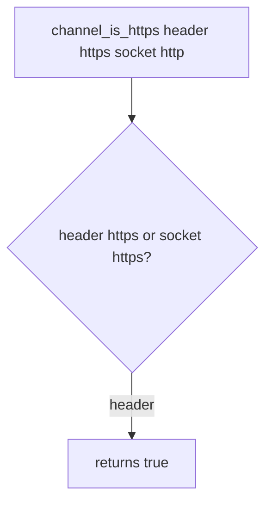

# 5.4-LO-03 — Observe the believed header, do not trophy a strip attack

**Kind:** mechanism-lab
**Loop step:** 3 Break
**Standards:** OWASP ASVS 5.0.0 (final) `v5.0.0-12.2.1`. RFC 9846 TLS 1.3 (final). `v5.0.0-12.1.4` / `v5.0.0-12.1.5` are **Level 3, advanced**, not this pytest.

## Authorized scope

`labs/5.4/5.4-lab` only. The fixture is an in-process `channel_is_https`. Synthetic headers and `server_scheme`. It does not open a socket or a CDN. Do not probe a public host, an employer load balancer, or a classmate preview as this exercise.

**Forbidden outcome:** client-supplied `X-Forwarded-Proto: https` on an `http` socket counts as TLS. `channel_is_https({"X-Forwarded-Proto": "https"}, "http")` returns true.

Attacker capability in this lab: a cleartext client who can set `X-Forwarded-Proto`. That stands in for a clinic SPA whose axios baseURL is `https://` while the API socket is `http`, or a dashboard “Force HTTPS” toggle that trusts the header. Trust assumption: `channel_is_https` is supposed to bind the **server socket**, not a client claim. uvicorn `--proxy-headers`, a CDN product name, and HSTS preload are not in the TCB for this cell.

## Mental model: header OR socket



The vulnerable tree demonstrates **cause** (confused deputy), not an SSLStrip walkthrough. Preconditions: `channel_is_https` returns true if the header is `https` **or** the socket is `https`. You do not need a live MITM. You must not run one.

ASVS `v5.0.0-12.2.1` wants TLS for external HTTP without fallback. A client header is not that TLS.

## What to read in the fixture

`vulnerable/channel.py` returns true if the header is `https` **or** the socket is `https`. Tests:

- `test_client_forwarded_proto_is_not_tls`
- `test_plain_http_is_not_https`
- `test_server_https_counts` — honest socket-https path; may pass on both

You do not need a new header name. The failure of `test_client_forwarded_proto_is_not_tls` *is* the evidence.

Do not open the fixed tree yet. Diagnose the cause first.

## Root cause vs impact vs prevention vs detection vs recovery

| Slice | This lab |
|---|---|
| Required property | Client Forwarded-Proto does not make the channel TLS |
| Root cause | App believes the client about the channel |
| Preconditions | Header `https` OR socket `https` returns true |
| Trigger | `channel_is_https({"X-Forwarded-Proto": "https"}, "http")` |
| Impact | Cookies and HSTS fire as if TLS while the hop is cleartext |
| Prevention | Bind scheme to `server_scheme == "https"` only; bound proxy identity later |
| Detection | `header_https_socket_http` metric |
| Recovery | Stop trusting the header; revoke cookies issued on that path |
| Not the lesson | A CDN product name, HSTS preload, or a live strip |

## Framework defaults versus the channel guarantee

uvicorn `--proxy-headers` with a wildcard trusted hop will believe whoever sent the header. FastAPI `Request.url.scheme` after that middleware is not the socket. Next.js `headers()` on the client is not TLS. The application guarantee is: **this** fixture, header https + socket http is False.

## Practice

```text
python3 -m pytest labs/5.4/5.4-lab/tests --impl vulnerable
```

Record `test_client_forwarded_proto_is_not_tls`. Do not probe public hosts. An environment error is not security evidence.

## Transfer

Clinic SPA axios `https://` vs API socket `http`. Predict without leaving this directory. Do not probe a live clinic.

## Non-goals

No live-target instructions. Synthetic headers only.
