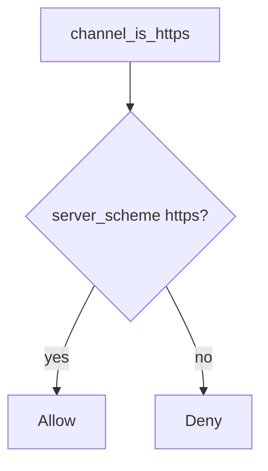

# Bind the scheme to the server socket

**Kind:** design-exercise
**Loop step:** 4 Build

## The rule

`channel_is_https` must use `server_scheme == "https"` only. Namely a bound proxy identity if you add one later — not trusting a header name, not “Force HTTPS” in a UI, not an API-client `https://` base URL, not HSTS preload.

Transport authenticity needs this: ignore the client proto. Fail closed: unknown scheme **denies** TLS claims (do not treat as https). Do not open the door because the header “looks right.”

## Picture: ignore the client proto



`channel_is_https` is `server_scheme == "https"`. If you end TLS at the load balancer, bind that peer’s identity — the header name is not what you trust. Pinning is leftover (later on phones), not a universal rule. Mutual TLS is a named leftover for service identity, not this header rule.

TLS has to have no cleartext fallback — the scheme check.

## What the repaired files must show

Do not treat `fixed/channel.py` as a production load balancer.

| After the fix | Must be true |
|---|---|
| socket https | true |
| socket http | false |
| header https + socket http | false |

Fail closed: if you cannot ask the socket, the answer is no. Uncertainty is a **deny**, not a yes because the dashboard still showed “HTTPS.”

## What this is not

- A server flag that trusts proxy headers from `*`.
- HSTS on an app that still accepts http.
- Pinning as a universal rule.
- Mutual TLS (named leftover).
- A dashboard “Force HTTPS” toggle.
- The client URL bar as the socket.

## What the tool cannot do

- TLS ending at the load balancer still needs a **bound** hop, not a header from anyone.
- End-to-end messaging and pinning versus breakage wait as leftover.
- Certificate checks are a client-side rule, not this helper.
- OCSP stapling and encrypted client hello are advanced extras.
- Phone network checks wait for later.
- Cookies already issued on the cleartext path still need revoke.

## Practice

Name the check (`server_scheme == "https"`). Run:

```text
python3 -m pytest labs/5.4/5.4-lab/tests --impl fixed
```

## Use it somewhere new

Stop treating the page’s `https://` API client as the API socket; bind cookies and HSTS to the server scheme.

## What can still go wrong

TLS to the load balancer; pinning leftover; OCSP and encrypted client hello as advanced extras; cookies already issued on the cleartext path.

## What this page is not doing

Do not probe a live host. Do not claim a course gate from an HSTS preload list.
