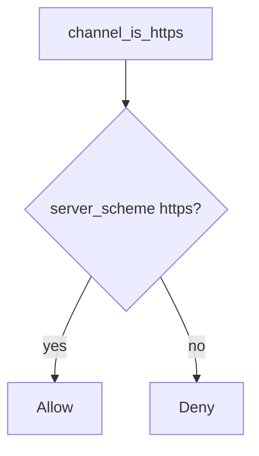

# 5.4-LO-04 — Bind the scheme to the server socket

**Kind:** design-exercise
**Loop step:** 4 Build
**Standards:** OWASP ASVS 5.0.0 (final) `v5.0.0-12.2.1`.

## Structural means the client cannot assert TLS

`channel_is_https` must use `server_scheme == "https"` only. Structural means a bound proxy identity if you add one later — not trusting a header name, not “Force HTTPS” in a UI.

## Mental model: ignore the client proto



Fail-safe: unknown scheme **denies** TLS claims (do not treat as https).

## Why this restores the cell

| After the fix | Must be true |
|---|---|
| socket https | true |
| socket http | false |
| header https + socket http | false |

## What this is not

`--proxy-headers` with `*`. HSTS on an app that still accepts http. Pinning as a universal rule. mTLS (named residual).

## Practice

Name predicate. Run:

```
python3 -m pytest labs/5.4/5.4-lab/tests --impl fixed
```

Must pass.

## Transfer

Clinic: stop treating axios `https://` as the API socket.

## Residual risk

TLS termination at LB; e2e messaging; `v5.0.0-12.1.4` / `v5.0.0-12.1.5` Level 3 advanced.
