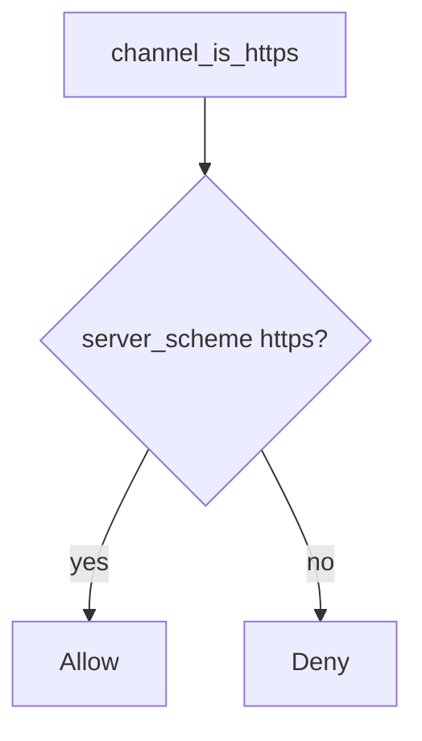

# 5.4-LO-04 — Bind the scheme to the server socket

**Kind:** design-exercise
**Loop step:** 4 Build
**Standards:** OWASP ASVS 5.0.0 (final) `v5.0.0-12.2.1`. RFC 9846 TLS 1.3 (final). `v5.0.0-12.1.4` / `v5.0.0-12.1.5` are **Level 3, advanced**.

## Structural means the client cannot assert TLS

`channel_is_https` must use `server_scheme == "https"` only. Structural means a bound proxy identity if you add one later — not trusting a header name, not “Force HTTPS” in a UI, not an axios `https://` baseURL, not HSTS preload.

The smallest restore for SecureCollab Phase 1 transport authenticity is: ignore the client proto. Fail-safe: unknown scheme **denies** TLS claims (do not treat as https). Do not fail open because the header “looks right.”

## Mental model: ignore the client proto



The lab’s fixed tree is `server_scheme == "https"`. Production still needs a bound load-balancer identity if you terminate TLS at the LB — that peer is TCB, the header name is not. Pinning is a trade-off (8.x), not a universal rule. mTLS is a named residual for service identity, not this header cell.

ASVS `v5.0.0-12.2.1` wants TLS without fallback. This pytest is that sentence for the scheme predicate.

## Why this restores the cell

| After the fix | Must be true |
|---|---|
| socket https | true |
| socket http | false |
| header https + socket http | false |

## What this is not

`--proxy-headers` with `*`. HSTS on an app that still accepts http. Pinning as a universal rule. mTLS (named residual). A dashboard “Force HTTPS” toggle. Client URL bar as the socket.

## Mechanism limits

- TLS termination at the LB still needs a **bound** hop, not a header from anyone.
- End-to-end messaging and pinning vs breakage wait as residuals.
- Certificate validation (`v5.0.0-12.3.2`) is a client cell, not this predicate.
- OCSP stapling / ECH (`v5.0.0-12.1.4` / `v5.0.0-12.1.5`) are Level 3 advanced.
- MASVS-NETWORK waits for 8.x.

## Practice

Name predicate (`server_scheme == "https"`). Run:

```text
python3 -m pytest labs/5.4/5.4-lab/tests --impl fixed
```

Must pass.

## Transfer

Clinic: stop treating axios `https://` as the API socket; bind cookies and HSTS to the server scheme.

## Residual risk

TLS-to-LB; pinning trade-off; OCSP/ECH Level 3; cookies already issued on the cleartext path.

## Non-goals

Do not probe a live host. Do not claim Gate 5 from an HSTS preload list.
