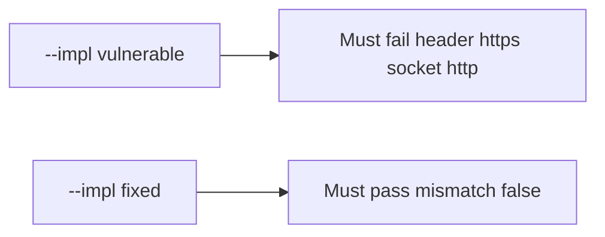

# 5.4-LO-05 — Evidence is header mismatch false, then a passing pair

**Kind:** verification-lab
**Loop step:** 5 Verify
**Standards:** OWASP ASVS 5.0.0 (final) `v5.0.0-12.2.1`.

## An invariant that cannot fail a test is still a slogan

“TLS is on” is not evidence. “Force HTTPS is checked” is a mechanism observation. The oracle is: `channel_is_https({"X-Forwarded-Proto": "https"}, "http") is False`. That observation must be **false** on `--impl vulnerable` (returns true) and **true** on `--impl fixed`.

## Mental model: vulnerable must fail: header https socket http

The failing observation on `--impl vulnerable` is **header https socket http**. A passing collection count is not this cell.



| Mode | Must show for this module |
|---|---|
| Normal | socket https is https; plain http is not (`test_server_https_counts` may pass on both) |
| Negative / abuse | client header does not make TLS; vulnerable must fail |
| Not claimed | Cert validation; mTLS; pinning; ECH |

Lab tests in `labs/5.4/5.4-lab/tests/test_property.py`. `test_client_forwarded_proto_is_not_tls` is a **forbidden-outcome** test: a client header is not allowed to count as a passing TLS control.

```text
python3 -m pytest labs/5.4/5.4-lab/tests --impl vulnerable
python3 -m pytest labs/5.4/5.4-lab/tests --impl fixed
```

Honest socket-https may pass on both implementations. That does not excuse the mismatch test. If vulnerable does not fail header-https + socket-http, the lab is miswired—fix the wiring, not the assertion.

## What the tests do not prove

- Certificate validation (`v5.0.0-12.3.2`)
- OCSP / ECH Level 3 (`v5.0.0-12.1.4` / `v5.0.0-12.1.5`)
- MASVS-NETWORK (8.x)
- Bound load-balancer identity in production
- Pinning as a requirement

Record those as residuals or later modules, not as silent passes.

## Practice

Execute both implementations this session. Write the fail/pass pair next to the matrix row. Reject a “test” that only greps `https` in a dashboard without calling `channel_is_https` on the mismatch.

## Transfer

Clinic SPA. A test that only asserts the site loads on port 443 is not this cell (see 9.3). A test that probes a live clinic is out of scope.

## Non-goals

Do not add a live TLS attack. Do not log cookie values. Keys stay out of this file.
