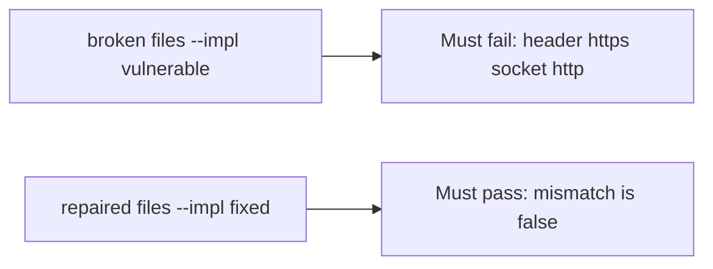

# HTTPS in the header with HTTP on the socket must fail

**Kind:** verification-lab
**Loop step:** 5 Verify

## Check it

A TLS checkbox does not ignore a spoofed forwarded header. “Force HTTPS” is a dashboard tick. `channel_is_https({"X-Forwarded-Proto": "https"}, "http")` has to be False. On the broken files the helper still returns true. On the repaired files it does not.

## Picture: header https, socket http must fail

Asserting “HTTPS is on” can still hide that a client header still counts as TLS.



If both pass, you are not looking at header versus socket.

## What the check has to show

| Mode | Must show for this topic |
|---|---|
| Normal | socket https is https; plain http is not (`test_server_https_counts` may pass on both) |
| Wrong input / abuse | client header does not make TLS; broken files must fail |
| Failure | unknown scheme does not count as https |
| Not claimed | Certificate checks; mutual TLS; pinning; encrypted client hello |

The test `test_client_forwarded_proto_is_not_tls` calls `channel_is_https` with header https and socket http. That check is there so a client header counted as TLS still fails.

An `https` tile on a dashboard is not `channel_is_https` on the mismatch. This practice never opens a live load balancer.

```text
python3 -m pytest labs/5.4/5.4-lab/tests --impl vulnerable
python3 -m pytest labs/5.4/5.4-lab/tests --impl fixed
```

Map the test to the header-https × socket-http row you wrote. A socket that really is https may pass on both sides. You still have to catch header-https with a socket that is http. If the broken files do not fail header-https + socket-http, the lab is miswired — fix the wiring, not the check. A setup error is not proof the rule holds.

## What the tests do not prove

- Certificate checks (a client-side rule)
- OCSP stapling / encrypted client hello (advanced extras)
- Phone network checks (later)
- Bound load-balancer identity in production
- Pinning as a requirement

## Practice

Call `channel_is_https` on the mismatch. An `https` tile on a dashboard is the hop, not the forwarded header.

## Use it somewhere new

Loading a page on port 443 is availability, not a spoofed forwarded header. Do not run a test that probes a live clinic.

## What this page is not doing

Do not add a live TLS attack. Do not log cookie values. Answer keys are not on this site.
